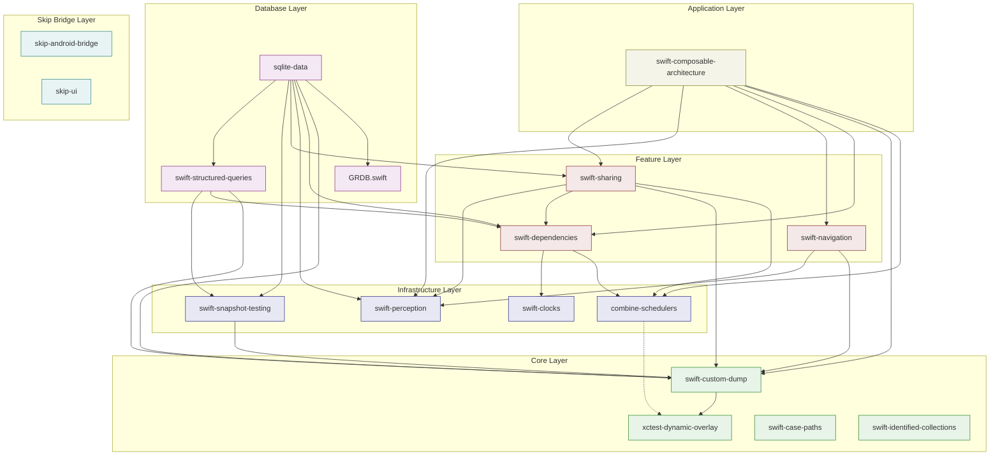

# R5: Fork Documentation Research

**Date:** 2026-02-22
**Purpose:** Comprehensive audit of all 17 fork submodules for Phase 7 `docs/FORKS.md` generation.

## Summary

The project maintains 17 fork submodules in `forks/`, all tracking the `dev/swift-crossplatform` branch. These forks span three ecosystems:

- **Point-Free ecosystem** (13 forks): TCA and its transitive dependencies
- **Skip ecosystem** (2 forks): skip-android-bridge, skip-ui
- **Database ecosystem** (2 forks): GRDB.swift, sqlite-data

Total fork commits ahead of upstream: **162** across all forks. The heaviest forks are swift-composable-architecture (39 commits, 84 files), swift-navigation (27 commits, 17 files), swift-sharing (26 commits, 16 files), and sqlite-data (16 commits, 15 files).

Key findings:
- All forks use `origin/main` as upstream ref except **GRDB.swift** which uses `origin/master`
- **swift-case-paths** and **swift-identified-collections** show 0 commits ahead via `rev-list --count` but have file diffs — they were rebased/cherry-picked onto a different upstream commit
- Several forks still reference `flote-works/` branch names in their Package.swift deps (inherited from an earlier fork source), though URLs have been updated to `jacobcxdev/`
- The most complex rebase targets are swift-composable-architecture and swift-navigation due to extensive SwiftUI guard/un-guard iteration cycles

## Per-Fork Metadata

### 1. combine-schedulers

| Field | Value |
|-------|-------|
| **Upstream** | pointfreeco/combine-schedulers |
| **Upstream version** | 1.1.0 |
| **Commits ahead** | 4 |
| **Files changed** | 5 files, +22 / -18 |
| **Remote** | origin (jacobcxdev), flote-works |

**Commits:**
- `624c738` Guard Apple-specific SwiftUI code with `!os(Android)`
- `9e5d118` build: enable OpenCombineSchedulers trait by default
- `eb04561` build: bump dependency minimums for Android compatibility
- `3856c9c` build: extended platform support to Android

**Dependencies (fork-internal):** xctest-dynamic-overlay (upstream), OpenCombine, swift-concurrency-extras (upstream)

---

### 2. GRDB.swift

| Field | Value |
|-------|-------|
| **Upstream** | groue/GRDB.swift |
| **Upstream version** | v7.10.0 |
| **Commits ahead** | 1 |
| **Files changed** | 85 files, +13,871 / -1,378 |
| **Remote** | origin (jacobcxdev), flote-works |
| **Note** | Uses `origin/master` (not `origin/main`) |

**Commits:**
- `36dba72` Add Android cross-compilation support

**Dependencies:** None (standalone, only swift-docc-plugin for docs)

> **Warning:** Despite being only 1 commit, the diff is massive (85 files, 13K+ insertions) — this is likely a large Android compatibility patch touching SQLite/platform layers across the entire codebase.

---

### 3. skip-android-bridge

| Field | Value |
|-------|-------|
| **Upstream** | skiptools/skip-android-bridge |
| **Upstream version** | 0.6.1 |
| **Commits ahead** | 3 |
| **Files changed** | 1 file, +163 / -2 |
| **Remote** | origin (jacobcxdev) |

**Commits:**
- `6f129f8` fix: handle pthread_key_create destructor ptr optionality across platforms
- `b1925b8` fix(android): add import Android for pthread APIs
- `0d028b0` feat(observation): implement record-replay bridge with diagnostics API

**Dependencies:** skip, skip-foundation, swift-jni, skip-bridge, swift-android-native (all Skip ecosystem, not forked)

---

### 4. skip-ui

| Field | Value |
|-------|-------|
| **Upstream** | skiptools/skip-ui |
| **Upstream version** | 1.49.0 |
| **Commits ahead** | 1 |
| **Files changed** | 2 files, +27 / -0 |
| **Remote** | origin (jacobcxdev) |

**Commits:**
- `0e34169` feat(observation): add ViewObservation hooks to View and ViewModifier Evaluate()

**Dependencies:** skip, skip-model, skip-bridge (all Skip ecosystem, not forked)

---

### 5. sqlite-data

| Field | Value |
|-------|-------|
| **Upstream** | nicklama/sqlite-data |
| **Upstream version** | 1.5.2 |
| **Commits ahead** | 16 |
| **Files changed** | 15 files, +410 / -180 |
| **Remote** | origin (jacobcxdev), flote-works |

**Commits (16):**
- `c153312` Update dependency URLs from flote-works to jacobcxdev
- `d45d155` Restore upstream platform minimums (iOS 13, macOS 10.15, watchOS 7)
- `912e845` Add Category B DynamicProperty parity tests for Fetch/FetchAll/FetchOne
- `cd8a10b` Un-guard DynamicProperty conformances for Android
- `db80603` Raise platform minimums to iOS 16/macOS 13 for SkipBridge compat
- `1278500` Add Category B parity tests for SQLiteData CRUD operations
- `aa55805` Re-guard DynamicProperty conformances — SharedReader.update() conflict
- `137bec1` Un-guard SwiftUI DynamicProperty conformances for Android
- `a655c9a` Revert "Un-guard DynamicProperty conformances and SwiftUI integration for Android"
- `f743699` Un-guard DynamicProperty conformances and SwiftUI integration for Android
- `01a896a` Fix Package@swift-6.0.swift to use flote-works/swift-custom-dump
- `b453d02` Use flote-works forks for swift-custom-dump and swift-snapshot-testing
- `fd0daaa` Point swift-perception to flote-works fork
- `280a190` Guard SwiftUI code with !os(Android) for Android builds
- `eb9e483` Add SkipBridge/SkipAndroidBridge/SwiftJNI for Android builds
- `f78c9f3` chore(deps): updated dependency sources

**Fork-internal deps:** GRDB.swift, swift-custom-dump, swift-dependencies, swift-perception, swift-sharing, swift-snapshot-testing, swift-structured-queries (all jacobcxdev forks)

---

### 6. swift-case-paths

| Field | Value |
|-------|-------|
| **Upstream** | pointfreeco/swift-case-paths |
| **Upstream version** | 1.7.2 |
| **Commits ahead** | 0 (rebased) |
| **Files changed** | 5 files, +57 / -139 |
| **Remote** | origin (jacobcxdev) |
| **Note** | HEAD differs from origin/main despite 0 rev-list count — rebased onto different upstream commit |

**Changed files:** Package.swift, Package@swift-6.0.swift, .editorconfig, CasePathableMacro.swift, CasePathableMacroTests.swift

**Dependencies:** xctest-dynamic-overlay (upstream), swift-syntax, swift-macro-testing, swift-docc-plugin

---

### 7. swift-clocks

| Field | Value |
|-------|-------|
| **Upstream** | pointfreeco/swift-clocks |
| **Upstream version** | 1.0.6 |
| **Commits ahead** | 14 |
| **Files changed** | 7 files, +95 / -25 |
| **Remote** | origin (jacobcxdev), flote-works |

**Commits (14):**
- `aaa258e` Restore upstream platform minimums (iOS 13, macOS 10.15)
- `9e60c05` Re-guard SwiftUI.swift on Android for compilation-order safety
- `2954ca1` Remove SwiftJNI direct dep — test with just SkipFuseUI
- `cd13a2e` Add SwiftJNI as direct dependency for CJNI module map propagation
- `7c0def4` Raise platform minimums to iOS 16/macOS 13 for SkipBridge compat
- `cc61201` Re-apply SkipFuseUI experiment for deeper investigation
- `801ec62` Revert SkipFuseUI experiment — CJNI module map not propagated
- `23c4820` Experiment: use skip-fuse-ui instead of skip-fuse for SwiftUI access
- `910fc72` Re-guard SwiftUI.swift for Android clean builds
- `10d4f96` Add Category B parity tests for clock environment keys
- `b24a702` Add skip-fuse dep and un-guard SwiftUI EnvironmentKey for Android
- `3da0d4f` Revert "Un-guard SwiftUI Environment keys for Android parity"
- `54d4e5d` Un-guard SwiftUI Environment keys for Android parity
- `414e309` Guard SwiftUI clock environment keys with `!os(Android)`

**Dependencies:** swift-concurrency-extras (upstream), xctest-dynamic-overlay (upstream), skip-fuse-ui (Skip, not forked)

---

### 8. swift-composable-architecture

| Field | Value |
|-------|-------|
| **Upstream** | pointfreeco/swift-composable-architecture |
| **Upstream version** | 1.23.1 |
| **Commits ahead** | 39 |
| **Files changed** | 84 files, +1,171 / -198 |
| **Remote** | origin (jacobcxdev), flote-works |

**Commits (39):** See git log above. Key themes:
- OpenCombine shim migration
- SkipBridge/SkipAndroidBridge dependency additions
- Extensive SwiftUI guard/un-guard cycles (presentation, navigation, binding)
- ObservationRegistrar integration for Compose recomposition
- AndroidParityTests addition
- Dependency URL migration (flote-works -> jacobcxdev)
- Navigation guard removal for Phase 5

**Fork-internal deps:** combine-schedulers, swift-custom-dump, swift-dependencies, swift-navigation, swift-perception, swift-sharing (all jacobcxdev forks)

---

### 9. swift-custom-dump

| Field | Value |
|-------|-------|
| **Upstream** | pointfreeco/swift-custom-dump |
| **Upstream version** | 1.4.1 |
| **Commits ahead** | 1 |
| **Files changed** | 3 files, +1 / -133 |
| **Remote** | origin (jacobcxdev), flote-works |

**Commits:**
- `110d6e6` Guard Apple-specific SwiftUI code with `!os(Android)`

**Dependencies:** xctest-dynamic-overlay (upstream)

---

### 10. swift-dependencies

| Field | Value |
|-------|-------|
| **Upstream** | pointfreeco/swift-dependencies |
| **Upstream version** | 1.11.0 |
| **Commits ahead** | 4 |
| **Files changed** | 10 files, +248 / -342 |
| **Remote** | origin (jacobcxdev), flote-works |

**Commits:**
- `3274961` Update dependency URLs from flote-works to jacobcxdev
- `01f18e1` Guard Apple-specific SwiftUI code with `!os(Android)`
- `d0e2294` Point swift-clocks to flote-works fork
- `45992be` chore(deps): switched to forked schedulers branch

**Fork-internal deps:** combine-schedulers, swift-clocks (jacobcxdev forks)

---

### 11. swift-identified-collections

| Field | Value |
|-------|-------|
| **Upstream** | pointfreeco/swift-identified-collections |
| **Upstream version** | 1.1.1 |
| **Commits ahead** | 0 (rebased) |
| **Files changed** | 5 files, +33 / -89 |
| **Remote** | origin (jacobcxdev) |
| **Note** | Similar to swift-case-paths — rebased, HEAD differs from origin/main |

**Changed files:** Package.swift, Package@swift-6.0.swift, CI workflow, IdentifiedArray+MutableCollection.swift, IdentifiedArrayTests.swift

**Dependencies:** swift-collections (Apple), swift-collections-benchmark (Apple)

---

### 12. swift-navigation

| Field | Value |
|-------|-------|
| **Upstream** | pointfreeco/swift-navigation |
| **Upstream version** | 2.6.0 |
| **Commits ahead** | 27 |
| **Files changed** | 17 files, +495 / -321 |
| **Remote** | origin (jacobcxdev), flote-works |

**Commits (27):** Key themes:
- SkipBridge/SkipAndroidBridge dependency additions
- SwiftUI guard/un-guard cycles (presentation layer, Binding polyfill)
- TextState/ButtonState Android bridges
- Alert and ConfirmationDialog Android support
- AndroidParityTests
- Dependency URL migration

**Fork-internal deps:** swift-custom-dump, swift-perception (jacobcxdev forks)

---

### 13. swift-perception

| Field | Value |
|-------|-------|
| **Upstream** | pointfreeco/swift-perception |
| **Upstream version** | 2.0.9 |
| **Commits ahead** | 13 |
| **Files changed** | 13 files, +385 / -151 |
| **Remote** | origin (jacobcxdev), flote-works |

**Commits (13):** Key themes:
- SwiftUI perception guard/un-guard cycles
- WithPerceptionTracking Android support (ultimately reverted)
- skip-fuse/skip-fuse-ui dependency additions
- Category B parity tests

**Dependencies:** xctest-dynamic-overlay (upstream), swift-syntax, skip-fuse, skip-fuse-ui (Skip, not forked)

---

### 14. swift-sharing

| Field | Value |
|-------|-------|
| **Upstream** | pointfreeco/swift-sharing |
| **Upstream version** | 2.7.4 |
| **Commits ahead** | 26 |
| **Files changed** | 16 files, +563 / -210 |
| **Remote** | origin (jacobcxdev), flote-works |

**Commits (26):** Key themes:
- FileStorageKey Android implementation (no-op file monitoring)
- AppStorageKey Android support
- OpenCombineShim for Android Combine availability
- NSRecursiveLock replacement for os_unfair_lock (Android compat)
- SwiftUI DynamicProperty guard/un-guard cycles
- Dependency URL migration

**Fork-internal deps:** combine-schedulers, swift-custom-dump, swift-dependencies, swift-perception (jacobcxdev forks)

---

### 15. swift-snapshot-testing

| Field | Value |
|-------|-------|
| **Upstream** | pointfreeco/swift-snapshot-testing |
| **Upstream version** | 1.18.9 |
| **Commits ahead** | 3 |
| **Files changed** | 2 files, +2 / -2 |
| **Remote** | origin (jacobcxdev), flote-works |

**Commits:**
- `b1c20a7` Update dependency URLs from flote-works to jacobcxdev
- `b999ced` Fix Package@swift-5.9.swift to use flote-works/swift-custom-dump
- `c17d4e2` Use flote-works fork for swift-custom-dump

**Fork-internal deps:** swift-custom-dump (jacobcxdev fork)

---

### 16. swift-structured-queries

| Field | Value |
|-------|-------|
| **Upstream** | pointfreeco/swift-structured-queries |
| **Upstream version** | 0.30.0 |
| **Commits ahead** | 4 |
| **Files changed** | 22 files, +14,351 / -173 |
| **Remote** | origin (jacobcxdev), flote-works |

**Commits:**
- `4975818` Update dependency URLs from flote-works to jacobcxdev
- `f2f9ba0` Fix Package@swift-6.0.swift to use flote-works/swift-custom-dump
- `4245793` Use flote-works forks for swift-custom-dump, swift-dependencies, and swift-snapshot-testing
- `fb5cc61` Fix `_StructuredQueriesSQLite3` for Android cross-compilation

**Fork-internal deps:** swift-custom-dump, swift-dependencies, swift-snapshot-testing (jacobcxdev forks)

> **Note:** The large diff (+14,351 lines) is likely due to the SQLite3 Android compilation fix touching generated/vendored code.

---

### 17. xctest-dynamic-overlay

| Field | Value |
|-------|-------|
| **Upstream** | pointfreeco/xctest-dynamic-overlay (swift-issue-reporting) |
| **Upstream version** | 1.9.0 |
| **Commits ahead** | 1 |
| **Files changed** | 2 files, +31 / -12 |
| **Remote** | origin (jacobcxdev) |

**Commits:**
- `2952bba` feat(02-02): add Android test context detection and dlsym resolution

**Dependencies:** swift-docc-plugin, carton (neither forked)

---

## Dependency Graph (Mermaid)

The graph below shows only fork-to-fork dependency edges (jacobcxdev references in Package.swift). External deps (Apple, Skip, pointfreeco upstream) are omitted for clarity.

**Key observations:**
- `swift-custom-dump` is the most depended-upon fork (7 dependents)
- `xctest-dynamic-overlay` is the foundational leaf (depended on by `swift-custom-dump` which cascades)
- `swift-composable-architecture` has the most fork-internal dependencies (6)
- `sqlite-data` has the second-most fork-internal dependencies (7, including GRDB.swift)
- `skip-android-bridge` and `skip-ui` are isolated from the Point-Free graph (no fork-internal deps)
- `swift-case-paths`, `swift-identified-collections`, and `swift-clocks` have no fork-internal deps (they depend only on upstream packages)

## Change Classification

### Upstreamable (generic improvements, `#if os(Android)` guards)

| Fork | Changes | Rationale |
|------|---------|-----------|
| **combine-schedulers** | SwiftUI `#if !os(Android)` guards, OpenCombineSchedulers trait | Clean platform guards, no behavioral change on Apple platforms |
| **swift-custom-dump** | SwiftUI `#if !os(Android)` guard | Removes 133 lines of Apple-only code from Android, no iOS impact |
| **swift-dependencies** | SwiftUI `#if !os(Android)` guard | Clean conditional compilation |
| **xctest-dynamic-overlay** | Android test context detection via dlsym | Additive, no iOS impact |
| **swift-case-paths** | Swift Syntax 602 support | Already a generic improvement |
| **swift-identified-collections** | Android support | Clean platform addition |

### Fork-Only (Android-specific implementations)

| Fork | Changes | Rationale |
|------|---------|-----------|
| **skip-android-bridge** | ObservationRecording record-replay bridge, pthread fixes | Skip-specific JNI bridge code, meaningless without Skip |
| **skip-ui** | ViewObservation hooks in Evaluate() | Skip-specific Compose integration |
| **GRDB.swift** | Android cross-compilation support | Massive 85-file patch likely touching SQLite linkage; hard to upstream without Android CI |
| **swift-structured-queries** | `_StructuredQueriesSQLite3` Android fix | Platform-specific SQLite compilation |
| **swift-sharing** | FileStorageKey no-op monitoring, AppStorageKey Android, NSRecursiveLock replacement, OpenCombineShim | Multiple Android-specific polyfills |
| **swift-composable-architecture** | ObservationRegistrar Compose integration, OpenCombine shim, navigation guards | Deeply tied to Skip/Compose runtime |

### Conditional (upstreamable if upstream accepts Android support)

| Fork | Changes | Rationale |
|------|---------|-----------|
| **swift-clocks** | SwiftUI EnvironmentKey guards, skip-fuse-ui dep | Would be clean with upstream Android target |
| **swift-perception** | SwiftUI perception guards, WithPerceptionTracking Android path | Upstream would need to accept Skip dependency |
| **swift-navigation** | TextState/ButtonState bridges, Alert/ConfirmationDialog Android, Binding polyfill | Large surface area but mostly `#if os(Android)` gated |
| **swift-snapshot-testing** | Dep URL changes only | Trivially upstreamable once custom-dump fork is resolved |
| **sqlite-data** | DynamicProperty Android support, parity tests | Depends on upstream accepting Android as a target platform |

### Dependency-URL-Only Changes (no code changes, just fork references)

These forks have commits that only switch Package.swift URLs from `pointfreeco/` or `flote-works/` to `jacobcxdev/`. These would become unnecessary if upstream accepted changes:

- swift-snapshot-testing (2 of 3 commits)
- swift-structured-queries (3 of 4 commits)
- swift-dependencies (2 of 4 commits)
- sqlite-data (3 of 16 commits)

## Rebase Risk Assessment

### Low Risk (clean rebase expected)

| Fork | Commits | Assessment |
|------|---------|------------|
| **xctest-dynamic-overlay** | 1 | Single additive commit, minimal conflict surface |
| **swift-custom-dump** | 1 | Single guard commit, low conflict risk |
| **swift-snapshot-testing** | 3 | Only Package.swift URL changes |
| **combine-schedulers** | 4 | Small, focused platform guards |
| **swift-dependencies** | 4 | Mostly Package.swift + one guard |
| **swift-case-paths** | 0 (rebased) | Already aligned with upstream, just different commit |
| **swift-identified-collections** | 0 (rebased) | Already aligned with upstream |
| **skip-ui** | 1 | Single file addition |

### Medium Risk (some conflict resolution needed)

| Fork | Commits | Assessment |
|------|---------|------------|
| **skip-android-bridge** | 3 | Concentrated in one file, but touches observation internals that upstream may modify |
| **swift-clocks** | 14 | Many revert/re-apply cycles inflate commit count; squashable to ~3 logical changes |
| **swift-structured-queries** | 4 | Large diff but mostly in one compilation-fix commit |
| **swift-perception** | 13 | Multiple guard/un-guard iterations; squashable to ~4 logical changes |

### High Risk (significant conflict potential)

| Fork | Commits | Assessment |
|------|---------|------------|
| **swift-sharing** | 26 | Extensive changes across 16 files, multiple polyfill layers (Combine, locking, storage). Upstream actively evolving. |
| **swift-navigation** | 27 | 17 files with TextState bridges and presentation layer changes. Upstream frequently adds new navigation APIs. |
| **sqlite-data** | 16 | 15 files with DynamicProperty and test additions. Depends on 7 other forks being stable. |
| **swift-composable-architecture** | 39 | **Highest risk.** 84 files changed, deeply intertwined with observation, navigation, and presentation systems. Upstream releases frequently (currently 1.23.x). Each upstream release likely creates merge conflicts. |
| **GRDB.swift** | 1 | **Deceptive.** Single commit but 85 files / 13K+ lines changed. A monolithic Android patch that will conflict with any upstream refactoring of SQLite internals. |

## Recommendations

### For `docs/FORKS.md` Generation

1. **Squash commit history before documenting.** Many forks have noisy revert/re-apply cycles (swift-clocks: 14 commits -> ~3 logical; swift-perception: 13 -> ~4; swift-composable-architecture: 39 -> ~10). Document logical changes, not individual commits.

2. **Separate Package.swift URL changes from code changes.** Several forks have commits that only change dependency URLs (flote-works -> jacobcxdev). These are fork-management overhead, not meaningful code changes. Document them separately.

3. **Flag GRDB.swift for special attention.** The 1-commit / 85-file pattern suggests a monolithic patch that should be broken into logical pieces before upstreaming.

4. **Include the Mermaid graph** showing fork-internal dependency edges. This makes the cascade impact of upstream updates visible — updating `swift-custom-dump` upstream would eliminate fork need for 7 downstream packages.

### For Upstream Contribution Strategy

1. **Start with leaf nodes:** xctest-dynamic-overlay (1 commit), swift-custom-dump (1 commit), and swift-case-paths (already aligned) are the easiest upstream PRs and would reduce fork maintenance burden.

2. **Batch the `#if !os(Android)` guards** across combine-schedulers, swift-custom-dump, swift-dependencies into a single coordinated upstream proposal for "Android compilation support."

3. **Defer GRDB.swift upstreaming** until the patch can be decomposed. The monolithic nature makes review impractical.

4. **Accept that skip-android-bridge and skip-ui changes are permanently fork-only** — they are Skip framework internals, not Point-Free library concerns.

### For Rebase Maintenance

1. **Establish upstream tracking tags.** Record the exact upstream commit each fork branched from (not just the tag). This makes future rebases deterministic.

2. **Squash before rebase.** The revert/re-apply noise in swift-clocks, swift-perception, swift-navigation, and swift-composable-architecture will create phantom conflicts during rebase. Squash to logical changes first.

3. **Prioritize swift-composable-architecture rebase cadence.** As the most change-heavy fork (39 commits, 84 files) depending on 6 other forks, it accumulates drift fastest. Rebase monthly at minimum.

4. **Consider splitting GRDB.swift fork** into platform-specific patches that can be conditionally applied, rather than maintaining a monolithic divergence.
