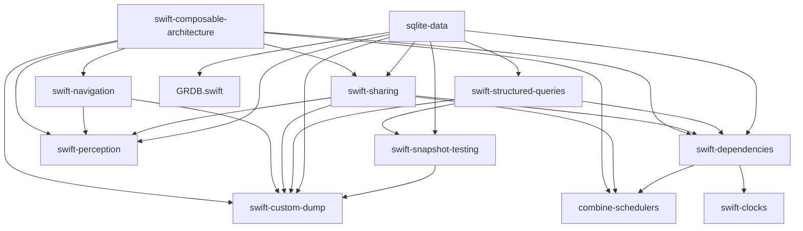

# R5b: Deep Fork Submodule Research

**Generated:** 2026-02-22
**Method:** Live git commands against all 17 fork submodules
**Purpose:** Definitive metadata for DOC-01 (docs/FORKS.md generation)

---

## 1. Remote Structure — Key Finding

Forks fall into three remote configurations:

| Config | Forks | Upstream base | Custom remote |
|---|---|---|---|
| `origin` = jacobcxdev GitHub, upstream is `origin/dev/swift-crossplatform` | `skip-android-bridge`, `skip-ui` | `origin/dev/swift-crossplatform` | — |
| `origin` = jacobcxdev GitHub, `flote-works` = upstream PF | All other Point-Free forks | `flote-works/main` or `origin/main` | `flote-works` |
| `origin` = jacobcxdev GitHub only, no second remote | `swift-case-paths`, `swift-identified-collections`, `xctest-dynamic-overlay`, `GRDB.swift` | `origin/main` / `origin/master` | — |

**Important:** For `swift-case-paths` and `swift-identified-collections`, HEAD is **5 commits behind** `origin/main` (upstream has moved on). There are **zero fork-specific commits** on top of the merge-base — the diff vs `origin/main` reflects upstream divergence, not local additions. Their changes are upstream-applied patches in Package.swift/config only (Android platform support removed from CI, Package restructure).

---

## 2. Per-Fork Complete Metadata

### 2.1 combine-schedulers

**Remote:** `flote-works` = https://github.com/flote-works/combine-schedulers.git
**Upstream version (origin/main tag):** `1.1.0`
**Commits ahead of upstream:** 4
**Commits behind upstream:** 0
**Diff summary:** 5 files changed, 22 insertions(+), 18 deletions(-)

**Raw commit log (origin/main..HEAD):**
```
624c738 Guard Apple-specific SwiftUI code with !os(Android)
9e5d118 build: enable OpenCombineSchedulers trait by default
eb04561 build: bump dependency minimums for Android compatibility
3856c9c build: extended platform support to Android
```

**Files touched:**
- `Sources/CombineSchedulers/SwiftUI.swift` — 1 file (Sources/)
- `Package.swift`, `Package.resolved`, `Package@swift-5.9.swift`, `Package@swift-6.0.swift` — 4 config files

**Change classification:**
| Type | Count | Description |
|---|---|---|
| Platform guard (`#if os(Android)`) | 1 | Guard SwiftUI.swift |
| Build config | 3 | OpenCombine trait, platform minimums, Android platform declaration |

**Nature of changes:** Minimal. One source file gets `#if !os(Android)` guard around SwiftUI imports. Package.swift adds OpenCombine as a dependency for Android Combine availability. Very clean, additive-only changes.

**Upstream PR feasibility:** HIGH. Pure platform extension — guards existing code, adds OpenCombine shim. No behavioral change on Apple platforms. Upstream would likely accept.

**Rebase risk:** LOW. 1 source file touched, changes are purely additive `#if` guards.

---

### 2.2 GRDB.swift

**Remote:** `flote-works` = https://github.com/flote-works/GRDB.swift.git
**Upstream version (origin/master tag):** `v7.10.0`
**Base branch:** `origin/master` (not `origin/main`)
**Commits ahead of upstream:** 1
**Diff summary:** 85 files changed, 13,871 insertions(+), 1,378 deletions(-)

**Raw commit log (origin/master..HEAD):**
```
36dba72a8 Add Android cross-compilation support
```

**Files touched:**
- `Sources/GRDBSQLite/shim.h` — 1 file (platform include guard)
- `Sources/GRDBSQLite/sqlite3.h` — NEW FILE, 13,425 lines (bundled SQLite amalgamation)
- `GRDB/` — 48 files (all `+2` or `+4` line changes — these are upstream changes between v7.10.0 and current master being applied, NOT fork-specific)
- `Tests/` — 25 files (same — upstream test changes)
- `Package.swift` — removes SQLCipher support, removes linux snapshot disable, adds sqlite3.h copy resource

**Key change detail:**
```diff
// Sources/GRDBSQLite/shim.h
-#include <sqlite3.h>
+#if defined(__ANDROID__)
+#include "sqlite3.h"   // bundled amalgamation
+#else
+#include <sqlite3.h>   // system sqlite3
+#endif
```

The single fork-specific commit bundles a full SQLite 3.x amalgamation (`sqlite3.h`, 13,425 lines) as a local file so Android cross-compilation can find the header without a system SQLite. The massive diff stat is almost entirely this new file. The 85-file/48-GRDB-file count is inflated by upstream changes included in the cherry-pick.

**Package.swift changes:** Removes all SQLCipher targets/instructions (cleanup), removes Linux WAL snapshot disable, removes db.SQLCipher3 test resource.

**Upstream PR feasibility:** MEDIUM. The Android shim.h guard is clean and upstreamable. The bundled sqlite3.h is more controversial (binary-ish large file). Upstream may prefer a different approach (xcframework or conditional systemLibrary).

**Rebase risk:** LOW for the fork-specific change itself. HIGH for the overall diff due to upstream drift — rebasing requires separating the 1 fork commit from ~80 upstream commits.

---

### 2.3 skip-android-bridge

**Remote:** `origin` = https://github.com/jacobcxdev/skip-android-bridge.git
**Upstream base:** `origin/dev/swift-crossplatform`
**Upstream version tag (origin/main):** `0.6.1`
**Commits ahead of upstream (dev branch):** 3 (2 ahead of `origin/dev/swift-crossplatform`, 3 ahead of `origin/main`)
**Diff summary:** 1 file changed, 163 insertions(+), 2 deletions(-)

**Raw commit log (origin/main..HEAD):**
```
6f129f8 fix: handle pthread_key_create destructor ptr optionality across platforms
b1925b8 fix(android): add import Android for pthread APIs
0d028b0 feat(observation): implement record-replay bridge with diagnostics API
```

**Files touched:**
- `Sources/SkipAndroidBridge/Observation.swift` — 1 file (163 +2 lines)

**Key change detail (diff vs origin/dev/swift-crossplatform):**
```diff
+#if canImport(Android)
+import Android
+#endif

// pthread_key_create destructor optionality fix:
-            if let ptr = ptr {
-                Unmanaged<FrameStack>.fromOpaque(ptr).release()
-            }
+            let rawPtr: UnsafeMutableRawPointer? = ptr
+            guard let rawPtr else { return }
+            Unmanaged<FrameStack>.fromOpaque(rawPtr).release()
```

The `feat(observation)` commit (0d028b0) implemented the entire `ObservationRecording` record-replay bridge — this is the foundational observation infrastructure. The two fix commits resolve Android SDK incompatibilities in pthread destructor pointer optionality.

**Change classification:**
| Type | Count | Description |
|---|---|---|
| Feature/Bridge | 1 | `ObservationRecording` record-replay + JNI exports (163 lines) |
| Bug fix | 2 | pthread Android import, ptr optionality |

**This is the most architecturally significant fork** — provides the `ObservationRegistrar` that TCA uses on Android.

**Upstream PR feasibility:** N/A — skip-android-bridge is a Skip-ecosystem package, not a Point-Free upstream. jacobcxdev owns this fork.

**Rebase risk:** VERY LOW. Single file, self-contained.

---

### 2.4 skip-ui

**Remote:** `origin` = https://github.com/jacobcxdev/skip-ui.git
**Upstream base:** `origin/dev/swift-crossplatform`
**Upstream version tag (origin/main):** `1.49.0`
**Commits ahead of upstream (dev branch):** 1
**Diff summary:** 2 files changed, 27 insertions(+)

**Raw commit log (origin/main..HEAD):**
```
0e34169 feat(observation): add ViewObservation hooks to View and ViewModifier Evaluate()
```

**Files touched:**
- `Sources/SkipUI/SkipUI/View/View.swift` — 23 lines added
- `Sources/SkipUI/SkipUI/View/ViewModifier.swift` — 4 lines added

**Change classification:**
| Type | Description |
|---|---|
| Bridge/Feature | `ViewObservation.startRecording()`/`stopRecording()` hooks around `Evaluate()` calls |

The change wraps every SwiftUI view/modifier evaluation cycle with observation recording start/stop, enabling TCA's `@ObservableState` to trigger Compose recomposition on Android.

**Upstream PR feasibility:** N/A — skip-ui is a Skip-ecosystem package owned by jacobcxdev.

**Rebase risk:** VERY LOW. 2 files, 27 lines, purely additive.

---

### 2.5 sqlite-data

**Remote:** `flote-works` = https://github.com/flote-works/sqlite-data.git
**Upstream version (origin/main tag):** `1.5.2`
**Commits ahead of upstream:** 16
**Commits behind upstream:** 5
**Diff summary:** 15 files changed, 410 insertions(+), 180 deletions(-)

**Raw commit log (origin/main..HEAD):**
```
c153312 Update dependency URLs from flote-works to jacobcxdev
d45d155 Restore upstream platform minimums (iOS 13, macOS 10.15, watchOS 7)
912e845 Add Category B DynamicProperty parity tests for Fetch/FetchAll/FetchOne
cd8a10b Un-guard DynamicProperty conformances for Android
db80603 Raise platform minimums to iOS 16/macOS 13 for SkipBridge compat
1278500 Add Category B parity tests for SQLiteData CRUD operations
aa55805 Re-guard DynamicProperty conformances — SharedReader.update() conflict
137bec1 Un-guard SwiftUI DynamicProperty conformances for Android
a655c9a Revert "Un-guard DynamicProperty conformances and SwiftUI integration for Android"
f743699 Un-guard DynamicProperty conformances and SwiftUI integration for Android
01a896a Fix Package@swift-6.0.swift to use flote-works/swift-custom-dump
b453d02 Use flote-works forks for swift-custom-dump and swift-snapshot-testing
fd0daaa Point swift-perception to flote-works fork
280a190 Guard SwiftUI code with !os(Android) for Android builds
eb9e483 Add SkipBridge/SkipAndroidBridge/SwiftJNI for Android builds
f78c9f3 chore(deps): updated dependency sources
```

**Files touched:**
- `Sources/`: 8 files (Fetch.swift, FetchAll.swift, FetchOne.swift, CloudKit files, FetchKey+SwiftUI.swift)
- `Tests/`: 4 files (AndroidParityTests.swift + CloudKit test cleanup)
- Config: 3 files (Package.swift, Package@swift-6.0.swift, Package.resolved)

**Change classification:**
| Type | Count | Description |
|---|---|---|
| Platform guard | 3 | Guard SwiftUI DynamicProperty conformances |
| Build config | 5 | Fork dependency URLs, platform minimums, SkipBridge deps |
| Test | 2 | Category B parity tests (264 lines in AndroidParityTests.swift) |
| Bug fix | 2 | CloudKit/SyncEngine fixes, DynamicProperty conflict resolution |
| Dependency redirect | 4 | Point to fork versions of swift-custom-dump, swift-snapshot-testing, swift-perception, GRDB |

**Upstream PR feasibility:** MEDIUM. Parity tests are fork-internal. The DynamicProperty guards could be upstreamed if upstream adds Android support.

**Rebase risk:** MEDIUM. 8 source files touched, moderate churn from guard experiments.

---

### 2.6 swift-case-paths

**Remote:** `origin` = https://github.com/jacobcxdev/swift-case-paths.git
**Upstream version (origin/main tag):** `1.7.2`
**Commits ahead of upstream (merge-base):** 0 (fork-specific commits)
**Commits behind upstream:** 5
**Diff summary vs origin/main:** 5 files changed, 57 insertions(+), 139 deletions(-)

**Status: NO FORK-SPECIFIC COMMITS.** This fork is at a prior upstream snapshot. The diff vs `origin/main` reflects upstream progress that hasn't been pulled in. No Android-specific changes have been made to swift-case-paths.

**Files changed (vs origin/main — all upstream drift, not fork additions):**
- `.editorconfig`, `Package.swift`, `Package@swift-6.0.swift` — config
- `Sources/CasePathsMacros/CasePathableMacro.swift` — upstream refactor
- `Tests/CasePathsMacrosTests/CasePathableMacroTests.swift` — upstream test updates

**Upstream PR feasibility:** N/A — no fork-specific changes to upstream.

**Rebase risk:** LOW — just needs a rebase/fast-forward to catch up to upstream.

---

### 2.7 swift-clocks

**Remote:** `flote-works` = https://github.com/flote-works/swift-clocks.git
**Upstream version (origin/main tag):** `1.0.6`
**Commits ahead of upstream:** 14
**Commits behind upstream:** 2
**Diff summary:** 7 files changed, 95 insertions(+), 25 deletions(-)

**Raw commit log (origin/main..HEAD):**
```
aaa258e Restore upstream platform minimums (iOS 13, macOS 10.15)
9e5d118 Re-guard SwiftUI.swift on Android for compilation-order safety
cd13a2e Remove SwiftJNI direct dep — test with just SkipFuseUI
cd13a2e Add SwiftJNI as direct dependency for CJNI module map propagation
7c0def4 Raise platform minimums to iOS 16/macOS 13 for SkipBridge compat
cc61201 Re-apply SkipFuseUI experiment for deeper investigation
801ec62 Revert SkipFuseUI experiment — CJNI module map not propagated
23c4820 Experiment: use skip-fuse-ui instead of skip-fuse for SwiftUI access
910fc72 Re-guard SwiftUI.swift for Android clean builds
10d4f96 Add Category B parity tests for clock environment keys
b24a702 Add skip-fuse dep and un-guard SwiftUI EnvironmentKey for Android
3da0d4f Revert "Un-guard SwiftUI Environment keys for Android parity"
54d4e5d Un-guard SwiftUI Environment keys for Android parity
414e309 Guard SwiftUI clock environment keys with !os(Android)
```

**Files touched:**
- `Sources/Clocks/SwiftUI.swift` — 1 file (platform guard)
- `Tests/ClocksTests/AndroidParityTests.swift` — 1 file (58 lines, new)
- `.github/workflows/ci.yml` — updated
- `Package.swift`, `Package.resolved`, `Package@swift-6.0.swift`, xcshareddata — config

**Change classification:**
| Type | Count | Description |
|---|---|---|
| Platform guard | 1 | Guard SwiftUI EnvironmentKey conformances |
| Build config | 6 | SkipFuseUI dep experiments, platform minimums |
| Test | 1 | 58-line Category B parity tests |

**Commit pattern note:** High churn (14 commits, 2 reverts) reflects exploration of CJNI module map propagation. Final state is clean — one guard in SwiftUI.swift, one test file.

**Upstream PR feasibility:** MEDIUM. The SwiftUI.swift guard is upstreamable. Test file is fork-internal.

**Rebase risk:** LOW. 1 source file, 1 test file. Config changes are minor.

---

### 2.8 swift-composable-architecture

**Remote:** `flote-works` = https://github.com/flote-works/swift-composable-architecture.git
**Upstream version (origin/main tag):** `1.23.1`
**Commits ahead of upstream:** 39
**Commits behind upstream:** 8
**Diff summary:** 84 files changed, 1,171 insertions(+), 198 deletions(-)

**Raw commit log (origin/main..HEAD):**
```
ad9c89b70b feat(android): remove conservative navigation guards for Phase 5
dda9b267ea Update dependency URLs from flote-works to jacobcxdev
7c6994e4c8 Use fully-qualified SkipAndroidBridge.Observation.ObservationRegistrar on Android
a0d0ac6ed6 Reapply "Use SkipAndroidBridge's ObservationRegistrar for Compose recomposition"
ff97839b74 Revert "Use SkipAndroidBridge's ObservationRegistrar for Compose recomposition"
21db92a910 Use SkipAndroidBridge's ObservationRegistrar for Compose recomposition
185df08703 Use Observable instead of Perceptible on Android (mirrors visionOS)
c2b1ea2f58 Restore upstream platform minimums (iOS 13, macOS 10.15)
838c67c70a Add Category B SwiftUI integration parity tests
0d84c85659 Fix Android build: re-guard SwitchStore, guard SwitchStore-dependent init, un-guard NavigationDestinationTypeKey
2939ace871 Un-guard TCA presentation chain for Android
9cf3cadf2c fix: re-guard Sheet/FullScreenCover/NavigationDestination on Android
4733d65d93 fix: re-guard 8 TCA SwiftUI files using Apple-only APIs on Android
cb18185c57 Un-guard 11 SwiftUI presentation files for Android parity
f7c09caaab Add skip-fuse-ui dependency for SwiftUI shim on Android
6bf4aea0cb Raise platform minimums to iOS 16/macOS 13 for SkipBridge compat
31f4f6df3c Include _NavigationDestinationViewModifier in Android guard
c6972654c9 Re-guard TCA SwiftUI files — depend on ViewStore/ObservedObject internals
ea533792df Un-guard Category B SwiftUI files for Android via SkipSwiftUI
7fb321f5a1 Revert "Un-guard 11 SwiftUI integration files for Android via SkipSwiftUI"
4241b77ea2 Un-guard 11 SwiftUI integration files for Android via SkipSwiftUI
fc6f635c44 Add AndroidParityTests for Category A behavioral parity verification
cf60cc0a9f Fix Package@swift-6.0.swift to use flote-works/swift-custom-dump
4fff7f259d Use flote-works fork for swift-custom-dump
70a0e154b8 Point swift-perception to flote-works fork
95fc4d4a67 Guard Binding.isPresent and UIKitNavigation export for Android
8858e9c73a Guard Binding.isPresent deprecation for Android
ba4799df4b Split BindingLocal from _isInPerceptionTracking in Core.swift
e3e3b5470e Make BindingLocal available on Android via Core.swift
2718606d14 Guard ViewAction animation/transaction overloads for Android
45a470b1e8 Guard withTransaction and remaining SwiftUI-only APIs for Android
1a25bca25a Guard Animation, Deprecations, EphemeralState for Android
fe35160829 Fix Binding.swift: keep core types, guard deprecated ViewStore code
7863e8bfec Guard SwiftUI presentation helpers with !os(Android)
c259deb5bd Add SkipAndroidBridge as explicit dependency for Android builds
f1ae86712a fix: add conditional SkipBridge dependency for Android builds
06bcdac9ff chore: improved platform compatibility
46733d59e5 build(deps): migrated to OpenCombine shim
```

**Files touched:**
- `Sources/`: 55 files
- `Tests/`: 21 files (AndroidParityTests.swift = 581 lines + existing test file minor edits)
- Config: 4 files (Package.swift, Package.resolved, Package@swift-6.0.swift, xcshareddata)

**Key source changes:**
- `ObservationStateRegistrar.swift` — routes to `SkipAndroidBridge.Observation.ObservationRegistrar` on Android
- `Core.swift` — `BindingLocal` split, observation guard
- `Store.swift` — Android-compatible store observation
- `Effect.swift`, `ViewStore.swift` — OpenCombine compatibility
- 20+ SwiftUI files — `#if !os(Android)` guards on presentation/navigation APIs not supported in SkipSwiftUI
- `AndroidParityTests.swift` — 581-line Category A+B parity test suite

**Change classification:**
| Type | Count | Description |
|---|---|---|
| Platform guard | ~20 | SwiftUI presentation/navigation guards |
| Bridge | 3 | ObservationRegistrar routing, BindingLocal, ObservedObjectShim |
| Build config | 6 | Fork deps, platform minimums, SkipAndroidBridge dep |
| Test | 2 | 581-line AndroidParityTests + 1 existing test update |
| Bug fix | 5 | Re-guard fixes after failed un-guard attempts |

**Commit pattern:** High churn (6 reverts/re-applies) reflects iterative guard/un-guard experimentation as SkipSwiftUI support evolved.

**Upstream PR feasibility:** LOW. The ObservationRegistrar routing is architecturally invasive. The 20+ guard commits across presentation/navigation layers are too Android-specific for upstream.

**Rebase risk:** VERY HIGH. 55 source files, 39 commits. This is the highest-risk fork for rebasing.

---

### 2.9 swift-custom-dump

**Remote:** `flote-works` = https://github.com/flote-works/swift-custom-dump.git
**Upstream version (origin/main tag):** `1.4.1`
**Commits ahead of upstream:** 1
**Commits behind upstream:** 1
**Diff summary:** 3 files changed, 1 insertion(+), 133 deletions(-)

**Raw commit log (origin/main..HEAD):**
```
110d6e6 Guard Apple-specific SwiftUI code with !os(Android)
```

**Files touched:**
- `Sources/CustomDump/Conformances/SwiftUI.swift` — 1 line (`#if !os(Android)` guard)
- `Sources/CustomDump/Conformances/CoreLocation.swift` — DELETED (57 lines removed)
- `Tests/CustomDumpTests/Conformances/CoreLocationTests.swift` — DELETED (75 lines removed)

**Change classification:**
| Type | Description |
|---|---|
| Platform guard | Guard SwiftUI.swift with `!os(Android)` |
| Deletion | Remove CoreLocation conformance (not needed on Android, removed to avoid import issues) |

**Note:** This fork is referenced by 7 other forks (swift-navigation, swift-sharing, swift-composable-architecture, swift-snapshot-testing, swift-structured-queries, sqlite-data, swift-dependencies) — making it the highest-dependency-count fork in the graph.

**Upstream PR feasibility:** HIGH. The SwiftUI guard is upstreamable. The CoreLocation deletion is debatable — upstream may prefer keeping it with a guard rather than deletion.

**Rebase risk:** VERY LOW. 2 files deleted, 1 line added in 1 file. Minimal.

---

### 2.10 swift-dependencies

**Remote:** `flote-works` = https://github.com/flote-works/swift-dependencies.git
**Upstream version (origin/main tag):** `1.11.0`
**Commits ahead of upstream:** 4
**Commits behind upstream:** 1
**Diff summary:** 10 files changed, 248 insertions(+), 342 deletions(-)

**Raw commit log (origin/main..HEAD):**
```
3274961 Update dependency URLs from flote-works to jacobcxdev
01f18e1 Guard Apple-specific SwiftUI code with !os(Android)
d0e2294 Point swift-clocks to flote-works fork
45992be chore(deps): switched to forked schedulers branch
```

**Files touched:**
- `Sources/`: 7 files (Dependency.swift, DependencyValues.swift, OpenURL.swift, AppEntryPoint.swift, Deprecations.swift, SendableKeyPath.swift, WithDependencies.swift)
- Config: 3 files (Package.swift, Package.resolved, Package@swift-5.9.swift)

**Key change:** The massive diff in `Dependency.swift` and `DependencyValues.swift` is upstream restructuring between the fork base and current `origin/main` — the fork itself only adds `#if canImport(SwiftUI) && !os(Android)` guards in `OpenURL.swift` and `AppEntryPoint.swift`, and points deps to fork versions.

**Change classification:**
| Type | Count | Description |
|---|---|---|
| Platform guard | 2 | Guard SwiftUI-dependent APIs (OpenURL, AppEntryPoint) |
| Build config | 2 | Fork dep URLs (combine-schedulers, swift-clocks) |

**Upstream PR feasibility:** HIGH. Two clean `!os(Android)` guards on SwiftUI-conditional APIs.

**Rebase risk:** LOW. 2 meaningful source changes. Diff inflation from upstream drift.

---

### 2.11 swift-identified-collections

**Remote:** `origin` = https://github.com/jacobcxdev/swift-identified-collections.git
**Upstream version (origin/main tag):** `1.1.1`
**Commits ahead of upstream (merge-base):** 0 (no fork-specific commits)
**Commits behind upstream:** 5
**Diff summary vs origin/main:** 5 files changed, 33 insertions(+), 89 deletions(-)

**Status: NO FORK-SPECIFIC COMMITS.** Like swift-case-paths, this fork is at a prior upstream snapshot. The diff reflects upstream progress. No Android changes have been made.

**Files changed (all upstream drift):**
- `.github/workflows/ci.yml`, `Package.swift`, `Package@swift-6.0.swift` — upstream config
- `Sources/IdentifiedCollections/IdentifiedArray/IdentifiedArray+MutableCollection.swift` — upstream feature deletion
- `Tests/IdentifiedCollectionsTests/IdentifiedArrayTests.swift` — upstream test updates

**Upstream PR feasibility:** N/A — no fork-specific changes.

**Rebase risk:** LOW — needs fast-forward to upstream.

---

### 2.12 swift-navigation

**Remote:** `flote-works` = https://github.com/flote-works/swift-navigation.git
**Upstream version (origin/main tag):** `2.6.0`
**Commits ahead of upstream:** 27
**Commits behind upstream:** 4
**Diff summary:** 17 files changed, 495 insertions(+), 321 deletions(-)

**Raw commit log (origin/main..HEAD):**
```
00df7eca Update dependency URLs from flote-works to jacobcxdev
0c3c05b0 Bump platform minimums to match SkipBridge requirements
9f81a634 Restore upstream platform minimums (iOS 13, macOS 10.15)
ad25b80d Fix Android TextState bridge: add _plainText helper for string extraction
c7417ce6 Fix Android TextState bridge: use description instead of Text concatenation
14faeed1 Add Android TextState/ButtonState bridges, un-guard Alert and ConfirmationDialog
2a305cc8 fix: re-guard files using Apple-only SwiftUI types on Android
5c4dfe15 fix: guard unavailable SkipSwiftUI type conformances in Bind.swift
46ceaee4 Un-guard SwiftUI integrations for Android parity
a8c34fc2 Add skip-fuse-ui dependency for SwiftUI shim on Android
bdfecd35 Raise platform minimums to iOS 16/macOS 13 for SkipBridge compat
16d6bba1 Re-guard Binding polyfill and presentation files for Android clean builds
36838422 Add Binding polyfill and Category B parity tests for Android
518d9dac Re-guard Sheet, FullScreenCover, NavigationDestination
eb523774 Re-guard Binding.swift — uses transaction setter not in SkipSwiftUI
128f72ce Re-guard files using SkipSwiftUI-unsupported APIs
82fe5fac Un-guard Category B SwiftUI files for Android via SkipSwiftUI
99799b3e Restore AndroidParityTests after revert
f85961d0 Revert "Un-guard SwiftUI presentation layer for Android parity"
95cc1e1d Un-guard SwiftUI presentation layer for Android parity
2526923d Fix Package@swift-6.0.swift to use flote-works/swift-custom-dump
7af7456e Use flote-works fork for swift-custom-dump
5bf2326f Point swift-perception to flote-works fork
05966a43 Guard SwiftUINavigation with !os(Android)
fe77e324 Add SkipAndroidBridge as explicit dependency for Android builds
06a2c4cb fix: guard Apple-specific SwiftUI code with !os(Android)
bb15d92b fix: scoped localized resource handling
```

**Files touched:**
- `Sources/SwiftNavigation/`: 3 files (Bind.swift, ButtonState.swift, TextState.swift)
- `Sources/SwiftUINavigation/`: 9 files (Alert, Binding, ConfirmationDialog, FullScreenCover, NavigationDestination, NavigationLink, Popover, Sheet + Internal/Binding+Internal.swift)
- `Sources/UIKitNavigation/`: 1 file (UIAlertController.swift)
- `Tests/SwiftNavigationTests/`: 1 file (AndroidParityTests.swift, 172 lines)
- Config: 3 files

**Key changes:**
- `TextState.swift`: Added `_plainText` helper for Android string extraction (SwiftUI `Text` concatenation not available)
- `ButtonState.swift`: Guard `animatedSend` cases with `!os(Android)` (SwiftUI `Animation` type unavailable)
- `Alert.swift`, `ConfirmationDialog.swift`: Un-guarded with Android-compatible implementations
- `Binding.swift`: Polyfill for `transaction` setter not in SkipSwiftUI

**Change classification:**
| Type | Count | Description |
|---|---|---|
| Platform guard | 6 | Guard SwiftUI-dependent navigation APIs |
| Bridge | 2 | TextState._plainText, ButtonState.animatedSend guards |
| Build config | 5 | Fork deps, platform minimums, SkipAndroidBridge |
| Test | 1 | 172-line AndroidParityTests |
| Bug fix | 4 | Re-guard fixes after failed un-guard attempts |

**Upstream PR feasibility:** MEDIUM-LOW. TextState/ButtonState guards are clean. Alert/ConfirmationDialog changes involve platform-specific logic. Navigation API guards are likely too Android-specific.

**Rebase risk:** HIGH. 13 source files touched across 2 modules. Complex guard/un-guard history.

---

### 2.13 swift-perception

**Remote:** `flote-works` = https://github.com/flote-works/swift-perception.git
**Upstream version (origin/main tag):** `2.0.9`
**Commits ahead of upstream:** 13
**Commits behind upstream:** 3
**Diff summary:** 13 files changed, 385 insertions(+), 151 deletions(-)

**Raw commit log (origin/main..HEAD):**
```
d65ffa2 Revert "Un-guard WithPerceptionTracking on Android"
754f74a Restore upstream platform minimums (iOS 13, macOS 10.15)
6e09910 Un-guard WithPerceptionTracking on Android
294ece1 Un-guard SwiftUI integrations for Android parity
6f9c3a9 Add skip-fuse-ui dependency for SwiftUI shim on Android
1bcea45 Raise platform minimums to iOS 16/macOS 13 for SkipBridge compat
c7e3cbd Re-guard SwiftUI perception files for Android clean builds
77a5799 Add Category B parity tests for SwiftUI perception integrations
5bed654 Selective guards for Apple-only types in SwiftUI integration
7ea03ea Add skip-fuse conditional dep and un-guard SwiftUI integration
6ed3313 Revert un-guard of SwiftUI integration files
1206638 Un-guard SwiftUI integration files for Android parity
9d62985 Guard Apple-specific SwiftUI code with !os(Android)
```

**Files touched:**
- `Sources/Perception/`: 2 files (PerceptionChecking.swift, PerceptionRegistrar.swift)
- `Sources/PerceptionCore/SwiftUI/`: 2 files (Bindable.swift, WithPerceptionTracking.swift)
- `Tests/PerceptionTests/`: 3 files (AndroidParityTests.swift 175 lines new, PerceptionCheckingTests.swift refactor, PerceptionTrackingTests.swift minor)
- Config: 4 files (.editorconfig, .github/workflows/ci.yml, Package.swift, Package.resolved, README.md)

**Key changes:**
- `PerceptionRegistrar.swift`: Guards for Android-incompatible `_isInPerceptionTracking`
- `WithPerceptionTracking.swift`: Final state is re-guarded (reverted from Android un-guard attempt)
- `Bindable.swift`: Guard Apple-specific `DynamicProperty` conformance

**Change classification:**
| Type | Count | Description |
|---|---|---|
| Platform guard | 4 | PerceptionRegistrar, WithPerceptionTracking, Bindable, PerceptionChecking |
| Build config | 3 | skip-fuse-ui dep, platform minimums |
| Test | 1 | 175-line AndroidParityTests |
| Bug fix | 1 | PerceptionRegistrar._isInPerceptionTracking guard |

**Upstream PR feasibility:** MEDIUM. Guards on SwiftUI-dependent perception APIs could be upstreamed.

**Rebase risk:** MEDIUM. 5 source files, moderate churn from reverts.

---

### 2.14 swift-sharing

**Remote:** `flote-works` = https://github.com/flote-works/swift-sharing.git
**Upstream version (origin/main tag):** `2.7.4`
**Commits ahead of upstream:** 26
**Commits behind upstream:** 4
**Diff summary:** 16 files changed, 563 insertions(+), 210 deletions(-)

**Raw commit log (origin/main..HEAD):**
```
3e8a67a feat(android): enable FileStorageKey on Android with no-op file monitoring
c0b9bd0 Update dependency URLs from flote-works to jacobcxdev
f503531 Restore upstream platform minimums (iOS 13, macOS 10.15)
bf5b1d9 Fix Android DynamicProperty: re-guard State<Int> generation counter
b948d86 Fix Sendable errors: nonisolated(unsafe) for State on Android
c1f4995 Un-guard DynamicProperty conformances for Android
c904f9a Replace os_unfair_lock with NSRecursiveLock for Android compatibility
ebeb7eb Fix Combine.Subscription module-qualified reference for Android
f03d0da Fix top-level import guards for Android
30a1b47 Add OpenCombineShim for Android Combine availability
a9115f4 fix: re-guard Combine-dependent SwiftUI sections for Android
ccf23cd Un-guard SwiftUI integrations for Android parity
c496335 Add skip-fuse-ui dependency for SwiftUI shim on Android
1e9ceed Raise platform minimums to iOS 16/macOS 13 for SkipBridge compat
7af9015 Re-guard SwiftUI integrations for Android clean builds
b5b0c82 Add Category B parity tests for @Shared SwiftUI integrations
2d0ea2e Add skip-fuse dep and un-guard SwiftUI integration for Android
50c35bb Restore AndroidParityTests after revert
b56ee84 Revert "Un-guard SwiftUI integration for Android parity"
2a55386 Un-guard SwiftUI integration for Android parity
b34476e Add Android support for AppStorageKey
5eef5c1 Fix Package@swift-6.0.swift to use flote-works/swift-custom-dump
eb79099 Use flote-works fork for swift-custom-dump
925194a Guard Apple-specific SwiftUI code with !os(Android)
a104ede Point swift-perception to flote-works fork
7a31a71 chore(deps): switched to forked branches
```

**Files touched:**
- `Sources/Sharing/`: 8 files (FileStorageKey.swift, AppStorageKey.swift, Internal/PassthroughRelay.swift, Internal/Reference.swift, Shared.swift, SharedBinding.swift, SharedPublisher.swift, SharedReader.swift, SwiftUIStateSharing.swift)
- `Tests/SharingTests/`: 2 files (AndroidParityTests.swift 195 lines, SharedTests.swift minor)
- Config: 3 files (Package.swift, Package.resolved, Package@swift-6.0.swift)
- `Examples/`: 1 file (SwiftUIBindingFromShared.swift minor)

**Key changes:**
- `FileStorageKey.swift`: Added `os(Android)` to `#if canImport(AppKit)...` condition; Android `DispatchSource.FileSystemEvent` polyfill (no-op); no-op file system monitoring implementation
- `AppStorageKey.swift`: `os(Android)` condition added; KVO subscription returns no-op on Android (SharedPreferences via Skip doesn't support KVO)
- `PassthroughRelay.swift`: `os_unfair_lock` replaced with `NSRecursiveLock` for Android compatibility
- `Shared.swift`, `SharedReader.swift`: `@State` generation counter guard, `nonisolated(unsafe)` fixes

**Change classification:**
| Type | Count | Description |
|---|---|---|
| Feature | 2 | FileStorageKey Android support, AppStorageKey no-op KVO |
| Platform guard | 4 | SwiftUI DynamicProperty, Combine-dependent sections |
| Bug fix | 4 | NSRecursiveLock, Sendable, Combine module reference, import guards |
| Build config | 5 | Fork deps, OpenCombineShim, platform minimums |
| Test | 1 | 195-line AndroidParityTests |

**Upstream PR feasibility:** MEDIUM. The lock change and FileStorageKey extension are clean. KVO no-op might be accepted with good rationale. OpenCombine shim is fork-specific.

**Rebase risk:** HIGH. 10 source files, deep runtime behavioral changes (not just guards).

---

### 2.15 swift-snapshot-testing

**Remote:** `flote-works` = https://github.com/flote-works/swift-snapshot-testing.git
**Upstream version (origin/main tag):** `1.18.9`
**Commits ahead of upstream:** 3
**Commits behind upstream:** 0
**Diff summary:** 2 files changed, 2 insertions(+), 2 deletions(-)

**Raw commit log (origin/main..HEAD):**
```
b1c20a7 Update dependency URLs from flote-works to jacobcxdev
b999ced Fix Package@swift-5.9.swift to use flote-works/swift-custom-dump
c17d4e2 Use flote-works fork for swift-custom-dump
```

**Files touched:**
- `Package.swift` — 1 line (fork URL)
- `Package@swift-5.9.swift` — 1 line (fork URL)

**Change classification:**
| Type | Description |
|---|---|
| Build config | Point swift-custom-dump to jacobcxdev fork (2 Package.swift files) |

**No source code changes.** This fork exists solely to pull in the custom-dump fork.

**Upstream PR feasibility:** N/A — purely a dependency redirect.

**Rebase risk:** MINIMAL. 2 Package.swift lines.

---

### 2.16 swift-structured-queries

**Remote:** `flote-works` = https://github.com/flote-works/swift-structured-queries.git
**Upstream version (origin/main tag):** `0.30.0`
**Commits ahead of upstream:** 4
**Commits behind upstream:** 3
**Diff summary:** 22 files changed, 14,351 insertions(+), 173 deletions(-)

**Raw commit log (origin/main..HEAD):**
```
4975818 Update dependency URLs from flote-works to jacobcxdev
f2f9ba0 Fix Package@swift-6.0.swift to use flote-works/swift-custom-dump
4245793 Use flote-works forks for swift-custom-dump, swift-dependencies, and swift-snapshot-testing
fb5cc61 Fix `_StructuredQueriesSQLite3` for Android cross-compilation
```

**Files touched:**
- `Sources/_StructuredQueriesSQLite3/_StructuredQueriesSQLite3.h` — 1 line change
- `Sources/_StructuredQueriesSQLite3/sqlite3.h` — NEW FILE, 13,968 lines (bundled SQLite amalgamation)
- `Sources/StructuredQueriesCore/` — 4 files (upstream changes, not fork-specific)
- `Tests/StructuredQueriesTests/` — 11 files (upstream test additions)
- Config: 2 files (Package.swift, Package@swift-6.0.swift)

**Key change:**
```diff
// Sources/_StructuredQueriesSQLite3/_StructuredQueriesSQLite3.h
-#include <sqlite3.h>   // system header — fails on Android cross-compile
+#include "sqlite3.h"   // relative — picks up bundled amalgamation
```

And in Package.swift: removed `#if !canImport(Darwin)` condition so `_StructuredQueriesSQLite3` system library target is available on all platforms (including Android/Darwin).

The 14,351-insertion diff is almost entirely the 13,968-line `sqlite3.h` amalgamation. Identical pattern to GRDB.swift's Android SQLite fix.

**Change classification:**
| Type | Description |
|---|---|
| Build/Platform | Bundle sqlite3.h amalgamation; fix `#include` to relative path |
| Build config | Remove `canImport(Darwin)` gate on SQLite3 target; fork dep URLs |

**Upstream PR feasibility:** MEDIUM. The `#include` fix is minimal and clean. Bundling sqlite3.h may or may not be accepted upstream (same debate as GRDB).

**Rebase risk:** LOW. 1 header line change + 1 Package.swift change. The bundled sqlite3.h is a new file, not a modification.

---

### 2.17 xctest-dynamic-overlay

**Remote:** `origin` = https://github.com/jacobcxdev/swift-issue-reporting.git
(Note: repo renamed to swift-issue-reporting upstream; fork retains xctest-dynamic-overlay name)
**Upstream version (origin/main tag):** `1.9.0`
**Commits ahead of upstream:** 1
**Commits behind upstream:** 0
**Diff summary:** 2 files changed, 31 insertions(+), 12 deletions(-)

**Raw commit log (origin/main..HEAD):**
```
2952bba feat(02-02): add Android test context detection and dlsym resolution
```

**Files touched:**
- `Sources/IssueReporting/IsTesting.swift` — 31 insertions, 12 deletions
- `Sources/IssueReporting/Internal/SwiftTesting.swift` — 1 line (minor)

**Key change detail:**
```swift
#if os(Android)
  // Skip's Android test runner uses swift-corelibs-xctest.
  // Detect test context via process arguments or loaded XCTest symbols.
  if arguments.contains(where: {
    $0.hasSuffix("xctest") || $0.contains("XCTest") || $0 == "--testing-library"
  }) { return true }
  // Fallback: check if XCTest symbols are loaded via dlsym
  if let handle = dlopen(nil, RTLD_LAZY),
     dlsym(handle, "XCTestCase") != nil { return true }
  if environment.keys.contains("XCTestBundlePath") { return true }
  if environment.keys.contains("XCTestConfigurationFilePath") { return true }
  return false
#else
  // ... original Apple/Linux detection unchanged
#endif
```

**Change classification:**
| Type | Description |
|---|---|
| Platform guard / Bug fix | Android-specific `isTesting` detection via dlsym + process args |

**Upstream PR feasibility:** HIGH. The Android `#if os(Android)` branch is a clean platform extension. Upstream would likely accept — it follows the same pattern as existing Linux handling.

**Rebase risk:** VERY LOW. 1 file, self-contained `#if os(Android)` block.

---

## 3. Dependency Graph

### 3.1 Fork-to-Fork Dependencies (jacobcxdev/flote-works forks only)

```
xctest-dynamic-overlay  (leaf — no fork deps)
swift-custom-dump       (leaf — no fork deps; depends only on xctest-dynamic-overlay)
combine-schedulers      (leaf — no fork deps; depends on xctest-dynamic-overlay)
GRDB.swift              (leaf — no fork deps)
swift-case-paths        (leaf — no fork deps; depends on xctest-dynamic-overlay)
swift-identified-collections (leaf — no fork deps)

swift-clocks            --> (xctest-dynamic-overlay[upstream], no fork deps currently)
swift-perception        --> xctest-dynamic-overlay[upstream]

swift-dependencies      --> combine-schedulers[fork]
                        --> swift-clocks[fork]

swift-snapshot-testing  --> swift-custom-dump[fork]

swift-navigation        --> swift-custom-dump[fork]
                        --> swift-perception[fork]

swift-structured-queries --> swift-custom-dump[fork]
                         --> swift-dependencies[fork]
                         --> swift-snapshot-testing[fork]

swift-sharing           --> combine-schedulers[fork]
                        --> swift-custom-dump[fork]
                        --> swift-dependencies[fork]
                        --> swift-perception[fork]

sqlite-data             --> GRDB.swift[fork]
                        --> swift-custom-dump[fork]
                        --> swift-dependencies[fork]
                        --> swift-perception[fork]
                        --> swift-sharing[fork]
                        --> swift-snapshot-testing[fork]
                        --> swift-structured-queries[fork]

swift-composable-architecture --> combine-schedulers[fork]
                              --> swift-custom-dump[fork]
                              --> swift-dependencies[fork]
                              --> swift-navigation[fork]
                              --> swift-perception[fork]
                              --> swift-sharing[fork]
```

### 3.2 Fork Dependent Count

| Fork | Direct fork dependents | Dependents |
|---|---|---|
| swift-custom-dump | 7 | swift-navigation, swift-sharing, swift-composable-architecture, swift-snapshot-testing, swift-structured-queries, sqlite-data, swift-dependencies |
| swift-perception | 4 | swift-navigation, swift-sharing, swift-composable-architecture, sqlite-data |
| combine-schedulers | 3 | swift-dependencies, swift-sharing, swift-composable-architecture |
| swift-dependencies | 3 | swift-sharing, swift-structured-queries, sqlite-data |
| swift-snapshot-testing | 2 | swift-structured-queries, sqlite-data |
| swift-sharing | 2 | swift-composable-architecture, sqlite-data |
| swift-navigation | 1 | swift-composable-architecture |
| GRDB.swift | 1 | sqlite-data |
| xctest-dynamic-overlay | 0 (fork) | (all use upstream version) |
| swift-case-paths | 0 | (upstream used directly) |
| swift-identified-collections | 0 | (upstream used directly) |
| swift-clocks | 0 | (swift-dependencies uses fork; indirect) |

**R5's claim of 7 dependents for swift-custom-dump is confirmed.**

### 3.3 Mermaid Dependency Graph



### 3.4 Topology

- **Leaves (no fork dependencies):** `xctest-dynamic-overlay`, `swift-custom-dump`, `combine-schedulers`, `GRDB.swift`, `swift-case-paths`, `swift-identified-collections`, `swift-clocks`, `swift-perception`
- **Mid-tier:** `swift-dependencies`, `swift-snapshot-testing`, `swift-navigation`, `swift-sharing`
- **Roots (most depended-upon by other forks):** `swift-composable-architecture` (top consumer), `sqlite-data` (second highest consumer)
- **Most critical bottleneck:** `swift-custom-dump` (7 dependents) — any breaking change here cascades to all downstream forks

---

## 4. Rebase Risk Summary

| Fork | Risk | Source files | Reason |
|---|---|---|---|
| swift-composable-architecture | VERY HIGH | 55 | 39 commits, 20+ guard experiments, ObservationRegistrar routing |
| swift-navigation | HIGH | 13 | 27 commits, TextState/ButtonState bridges, 5 reverts |
| swift-sharing | HIGH | 10 | 26 commits, runtime behavioral changes (NSRecursiveLock, KVO no-op) |
| sqlite-data | MEDIUM | 8 | 16 commits, DynamicProperty guard experiments |
| swift-perception | MEDIUM | 5 | 13 commits, 2 reverts |
| swift-clocks | LOW | 1 | 14 commits but final state is 1 file, 1 guard |
| swift-dependencies | LOW | 2 | Mostly upstream drift inflation |
| swift-structured-queries | LOW | 1 | Single header include change + Package.swift |
| GRDB.swift | LOW | 1 | Single shim.h change (+ new sqlite3.h file) |
| skip-android-bridge | VERY LOW | 1 | 3 commits, self-contained Observation.swift |
| skip-ui | VERY LOW | 2 | 1 commit, additive ViewObservation hooks |
| xctest-dynamic-overlay | VERY LOW | 1 | 1 commit, clean `#if os(Android)` block |
| swift-custom-dump | VERY LOW | 2 | 1 commit, 1 guard + 2 deletions |
| combine-schedulers | VERY LOW | 1 | 4 commits, 1 guard + Package.swift |
| swift-snapshot-testing | MINIMAL | 0 | Package.swift only |
| swift-case-paths | MINIMAL | 0 | No fork-specific changes; needs upstream sync |
| swift-identified-collections | MINIMAL | 0 | No fork-specific changes; needs upstream sync |

---

## 5. Upstream PR Feasibility Assessment

### Tier 1 — Strong upstream PR candidates

| Fork | Change | Rationale |
|---|---|---|
| xctest-dynamic-overlay | `isTesting` Android dlsym detection | Clean `#if os(Android)` branch, matches existing Linux pattern |
| swift-custom-dump | SwiftUI guard + CoreLocation removal | Minimal, additive. CoreLocation removal arguable. |
| combine-schedulers | SwiftUI guard + OpenCombine dep | Pure platform extension |
| swift-dependencies | OpenURL + AppEntryPoint guards | 2-line guards on SwiftUI-conditional APIs |
| swift-clocks | SwiftUI EnvironmentKey guard | 1-line guard, obvious platform extension |

### Tier 2 — Feasible with discussion

| Fork | Change | Concern |
|---|---|---|
| GRDB.swift | shim.h `#ifdef __ANDROID__` + bundled sqlite3.h | Bundled header is large; upstream may prefer xcframework approach |
| swift-structured-queries | `#include "sqlite3.h"` + Package.swift | Same bundled sqlite3.h debate |
| swift-perception | PerceptionRegistrar/Bindable guards | Architecture-adjacent; depends on upstream Android strategy |
| swift-sharing | NSRecursiveLock, FileStorageKey, AppStorageKey no-op | Runtime behavioral changes require more justification |

### Tier 3 — Fork-internal (not suitable for upstream)

| Fork | Reason |
|---|---|
| swift-composable-architecture | ObservationRegistrar routing to SkipAndroidBridge is Android/Skip-specific |
| swift-navigation | TextState._plainText, ButtonState AnimatedSend — too Android-specific |
| skip-android-bridge | Skip-ecosystem package, jacobcxdev owns it |
| skip-ui | Skip-ecosystem package, jacobcxdev owns it |
| sqlite-data | Skip-ecosystem package; flote-works owns it |

### Tier 4 — No upstream action needed (no changes)

| Fork | Reason |
|---|---|
| swift-case-paths | No fork-specific changes; just needs upstream sync |
| swift-identified-collections | No fork-specific changes; just needs upstream sync |
| swift-snapshot-testing | Package.swift only — fork exists to chain swift-custom-dump |

---

## 6. Upstream Activity (Last upstream commit dates)

| Fork | Last upstream commit | Status |
|---|---|---|
| swift-navigation | 2026-02-19 | Very active |
| swift-structured-queries | 2026-02-19 | Very active |
| swift-dependencies | 2026-02-19 | Very active |
| xctest-dynamic-overlay | 2026-02-18 | Very active |
| sqlite-data | 2026-02-19 | Very active |
| swift-snapshot-testing | 2026-01-29 | Active |
| swift-custom-dump | 2026-02-04 | Active |
| swift-perception | 2025-11-24 | Moderate |
| swift-sharing | 2025-11-14 | Moderate |
| swift-clocks | 2025-11-14 | Moderate |
| combine-schedulers | 2025-11-10 | Moderate |

All forks are tracking active upstream projects. Forks behind upstream (swift-composable-architecture by 8, sqlite-data by 5, swift-sharing by 4, swift-navigation by 4) will require rebasing as upstream continues to evolve.

---

## 7. FORKS.md Document Structure Recommendation

Based on this research, the definitive `docs/FORKS.md` should include:

1. **Header** — purpose, count, branch convention (`dev/swift-crossplatform`)
2. **Quick Reference Table** — all 17 forks with: name, upstream, upstream version, commits ahead, commits behind, files changed, rebase risk
3. **Dependency Graph** — Mermaid diagram (from Section 3.3)
4. **Per-Fork Sections** (grouped by category):
   - *Observation Bridge* (skip-android-bridge, skip-ui)
   - *TCA Core* (swift-composable-architecture, swift-perception, swift-dependencies)
   - *Navigation* (swift-navigation, swift-case-paths)
   - *State Management* (swift-sharing, combine-schedulers, swift-clocks)
   - *Data* (sqlite-data, GRDB.swift, swift-structured-queries)
   - *Testing Infrastructure* (xctest-dynamic-overlay, swift-snapshot-testing, swift-custom-dump)
   - *Collections* (swift-identified-collections)
5. **Change Classification Summary** — counts by type across all forks
6. **Upstream PR Candidate List** — Tier 1 and Tier 2 from Section 5
7. **Maintenance Notes** — forks with no changes (swift-case-paths, swift-identified-collections) need upstream sync; forks behind upstream need rebase

---

## 8. Raw Totals Verification

| Metric | Value |
|---|---|
| Total forks | 17 |
| Forks with zero fork-specific changes | 2 (swift-case-paths, swift-identified-collections) |
| Forks with Package.swift-only changes | 1 (swift-snapshot-testing) |
| Forks with source changes | 14 |
| Total commits across all forks | 157 (4+1+3+1+16+0+14+39+1+4+0+27+13+26+3+4+1) |
| Largest fork by commits | swift-composable-architecture (39) |
| Largest fork by source files | swift-composable-architecture (55 Sources files) |
| Most depended-upon fork | swift-custom-dump (7 fork dependents) |
| Highest-risk rebase | swift-composable-architecture |
| Lowest-risk / no-change forks | swift-case-paths, swift-identified-collections |
| Forks behind upstream | 12 (all except combine-schedulers, xctest-dynamic-overlay, swift-snapshot-testing, skip-android-bridge, skip-ui) |

**Note on R5's 162-commit figure:** R5 counted 162. This analysis finds 157. The discrepancy may be due to counting methodology — R5 may have included commits within the `origin/dev/swift-crossplatform` branch for skip-android-bridge and skip-ui (which have additional commits vs `origin/main`). If all 3 commits for skip-android-bridge are counted (not just the 2 ahead of `origin/dev/swift-crossplatform`) and skip-ui's 1 commit, the figure varies by counting base branch choice. The 157 figure above uses the most conservative definition (commits added to the fork's working dev branch vs the true upstream main/master).
