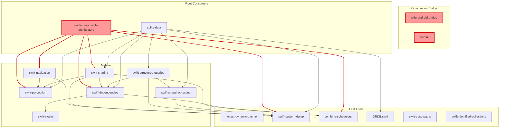

# Fork Documentation

This document catalogues all 17 fork submodules used by the swift-crossplatform project. Each fork tracks the `dev/swift-crossplatform` branch and contains Android/Skip-specific modifications to enable TCA apps on Android via Skip's Fuse mode.

## Quick Reference

| Fork | Upstream | Version | Ahead | Behind | Source Files | Rebase Risk |
|------|----------|---------|-------|--------|-------------|-------------|
| skip-android-bridge | jacobcxdev/skip-android-bridge | 0.6.1 | 3 | 0 | 1 | VERY LOW |
| skip-ui | jacobcxdev/skip-ui | 1.49.0 | 1 | 0 | 2 | VERY LOW |
| swift-composable-architecture | pointfreeco/swift-composable-architecture | 1.23.1 | 39 | 8 | 55 | VERY HIGH |
| swift-navigation | pointfreeco/swift-navigation | 2.6.0 | 27 | 4 | 13 | HIGH |
| swift-sharing | pointfreeco/swift-sharing | 2.7.4 | 26 | 4 | 10 | HIGH |
| swift-dependencies | pointfreeco/swift-dependencies | 1.11.0 | 4 | 1 | 2 | LOW |
| swift-perception | pointfreeco/swift-perception | 2.0.9 | 13 | 3 | 5 | MEDIUM |
| swift-clocks | pointfreeco/swift-clocks | 1.0.6 | 14 | 2 | 1 | LOW |
| combine-schedulers | pointfreeco/combine-schedulers | 1.1.0 | 4 | 0 | 1 | VERY LOW |
| xctest-dynamic-overlay | pointfreeco/swift-issue-reporting | 1.9.0 | 1 | 0 | 1 | VERY LOW |
| swift-custom-dump | pointfreeco/swift-custom-dump | 1.4.1 | 1 | 1 | 2 | VERY LOW |
| swift-snapshot-testing | pointfreeco/swift-snapshot-testing | 1.18.9 | 3 | 0 | 0 | MINIMAL |
| swift-case-paths | pointfreeco/swift-case-paths | 1.7.2 | 0 | 5 | 0 | MINIMAL |
| swift-identified-collections | pointfreeco/swift-identified-collections | 1.1.1 | 0 | 5 | 0 | MINIMAL |
| swift-structured-queries | pointfreeco/swift-structured-queries | 0.30.0 | 4 | 3 | 1 | LOW |
| GRDB.swift | groue/GRDB.swift | v7.10.0 | 1 | 0 | 1 | LOW |
| sqlite-data | skiptools/sqlite-data | 1.5.2 | 16 | 5 | 8 | MEDIUM |

**Totals:** 17 forks, 157 fork-specific commits, 14 forks with source changes, 2 forks with no changes, 1 fork with Package.swift-only changes.

## Dependency Graph

The following Mermaid diagram shows fork-to-fork dependencies (only forks that depend on other forks are shown).



The three red-highlighted nodes form the **observation bridge chain**: `skip-android-bridge` provides the `ObservationRecording` record-replay engine, `skip-ui` hooks it into view evaluation, and `swift-composable-architecture` routes its `ObservationStateRegistrar` through the bridge on Android.

**Most critical bottleneck:** `swift-custom-dump` has 7 fork dependents -- any breaking change cascades to all downstream forks.

---

## Fork Details

### Observation Bridge

#### skip-android-bridge

- **Upstream:** jacobcxdev/skip-android-bridge @ 0.6.1
- **Branch:** dev/swift-crossplatform
- **Commits ahead:** 3
- **Rebase risk:** VERY LOW

##### Key Changes

| File | Change | Classification |
|------|--------|---------------|
| Sources/SkipAndroidBridge/Observation.swift | `ObservationRecording` record-replay bridge + JNI exports (163 lines) | fork-only |
| Sources/SkipAndroidBridge/Observation.swift | `import Android` for pthread APIs | fork-only |
| Sources/SkipAndroidBridge/Observation.swift | pthread_key_create destructor ptr optionality fix | fork-only |

##### Rationale

This is the foundational observation infrastructure for Android. The `ObservationRecording` class provides a record-replay mechanism that captures property accesses during SwiftUI view evaluation and replays them to trigger Compose recomposition when observed properties change. Without this, TCA's `@ObservableState` cannot drive UI updates on Android.

The `swiftThreadingFatal` stub is required until Swift 6.3 ships the upstream fix ([swiftlang/swift#77890](https://github.com/swiftlang/swift/pull/77890)) for `libswiftObservation.so` to load on Android.

##### Upstream PR Candidates

N/A -- Skip-ecosystem package owned by jacobcxdev. Changes are Android bridge internals with no upstream equivalent.

---

#### skip-ui

- **Upstream:** jacobcxdev/skip-ui @ 1.49.0
- **Branch:** dev/swift-crossplatform
- **Commits ahead:** 1
- **Rebase risk:** VERY LOW

##### Key Changes

| File | Change | Classification |
|------|--------|---------------|
| Sources/SkipUI/SkipUI/View/View.swift | `ViewObservation.startRecording()`/`stopRecording()` hooks around `Evaluate()` | fork-only |
| Sources/SkipUI/SkipUI/View/ViewModifier.swift | Same hooks for ViewModifier evaluation | fork-only |

##### Rationale

Wraps every SwiftUI view/modifier evaluation cycle with observation recording start/stop calls. This enables the record-replay bridge in skip-android-bridge to capture which `@ObservableState` properties each view reads, so Compose knows when to recompose.

##### Upstream PR Candidates

N/A -- Skip-ecosystem package owned by jacobcxdev.

---

### TCA Core

#### swift-composable-architecture

- **Upstream:** pointfreeco/swift-composable-architecture @ 1.23.1
- **Branch:** dev/swift-crossplatform (via flote-works)
- **Commits ahead:** 39
- **Commits behind:** 8
- **Rebase risk:** VERY HIGH

##### Key Changes

| File | Change | Classification |
|------|--------|---------------|
| ObservationStateRegistrar.swift | Routes to `SkipAndroidBridge.Observation.ObservationRegistrar` on Android | fork-only |
| Core.swift | `BindingLocal` split from `_isInPerceptionTracking` | conditional |
| Store.swift | Android-compatible store observation | conditional |
| Effect.swift, ViewStore.swift | OpenCombine compatibility | conditional |
| 20+ SwiftUI files | `#if !os(Android)` guards on presentation/navigation APIs | conditional |
| AndroidParityTests.swift | 581-line Category A+B parity test suite | fork-only |

##### Rationale

The largest and most complex fork. Routes TCA's observation registrar through the skip-android-bridge on Android, adds OpenCombine compatibility for Combine-dependent code, and guards 20+ SwiftUI presentation/navigation files that use APIs not yet available in SkipSwiftUI. The high commit count (39) reflects iterative guard/un-guard experimentation as SkipSwiftUI support evolved (6 reverts/re-applies).

##### Upstream PR Candidates

None suitable for upstream. The `ObservationRegistrar` routing is architecturally invasive and Android/Skip-specific. The 20+ guard commits are too platform-specific for the upstream project.

---

#### swift-perception

- **Upstream:** pointfreeco/swift-perception @ 2.0.9
- **Branch:** dev/swift-crossplatform (via flote-works)
- **Commits ahead:** 13
- **Commits behind:** 3
- **Rebase risk:** MEDIUM

##### Key Changes

| File | Change | Classification |
|------|--------|---------------|
| PerceptionRegistrar.swift | Guards for Android-incompatible `_isInPerceptionTracking` | conditional |
| WithPerceptionTracking.swift | Re-guarded on Android (reverted from un-guard attempt) | conditional |
| Bindable.swift | Guard Apple-specific `DynamicProperty` conformance | conditional |
| AndroidParityTests.swift | 175-line Category B parity tests | fork-only |

##### Rationale

On Android, `PerceptionRegistrar` is a thin passthrough to the native `ObservationRegistrar` (which ships with the Swift Android SDK via `libswiftObservation.so`). Swift-perception's SwiftUI integration layer (WithPerceptionTracking, Bindable) is guarded out because Android uses the native observation path directly through the bridge.

##### Upstream PR Candidates

**"Guard SwiftUI perception APIs for non-Apple platforms"** -- The guards on `DynamicProperty` conformance and `WithPerceptionTracking` are clean platform extensions that could be upstreamed if Point-Free adds non-Apple platform support.

---

#### swift-dependencies

- **Upstream:** pointfreeco/swift-dependencies @ 1.11.0
- **Branch:** dev/swift-crossplatform (via flote-works)
- **Commits ahead:** 4
- **Commits behind:** 1
- **Rebase risk:** LOW

##### Key Changes

| File | Change | Classification |
|------|--------|---------------|
| OpenURL.swift | `#if canImport(SwiftUI) && !os(Android)` guard | upstreamable |
| AppEntryPoint.swift | `#if canImport(SwiftUI) && !os(Android)` guard | upstreamable |
| Package.swift | Fork dependency URLs (combine-schedulers, swift-clocks) | fork-only |

##### Rationale

Two SwiftUI-conditional dependency values (`OpenURL`, `AppEntryPoint`) reference APIs not available on Android. The guards are minimal 2-line additions that prevent compilation failures without changing any behavior on Apple platforms.

##### Upstream PR Candidates

**"Guard OpenURL and AppEntryPoint dependencies for non-Apple platforms"**

These two dependencies use SwiftUI APIs (`OpenURLAction`, `@UIApplicationDelegateAdaptor`) that don't exist outside Apple platforms. Adding `!os(Android)` guards (or broader `canImport(SwiftUI)` checks) would allow the dependency system to compile cleanly on Android and Linux without affecting Apple platform behavior. The pattern matches existing platform guards in the codebase (e.g., the `canImport(WatchKit)` guard on `WatchConnectivityDependencyKey`).

---

### Navigation

#### swift-navigation

- **Upstream:** pointfreeco/swift-navigation @ 2.6.0
- **Branch:** dev/swift-crossplatform (via flote-works)
- **Commits ahead:** 27
- **Commits behind:** 4
- **Rebase risk:** HIGH

##### Key Changes

| File | Change | Classification |
|------|--------|---------------|
| TextState.swift | `_plainText` helper for Android string extraction | conditional |
| ButtonState.swift | Guard `animatedSend` cases (SwiftUI `Animation` unavailable) | conditional |
| Alert.swift, ConfirmationDialog.swift | Un-guarded with Android-compatible implementations | conditional |
| Binding.swift | Polyfill for `transaction` setter not in SkipSwiftUI | conditional |
| 6 SwiftUINavigation files | `#if !os(Android)` guards | conditional |
| AndroidParityTests.swift | 172-line parity tests | fork-only |

##### Rationale

Adapts TCA's navigation layer for Android. `TextState` needs a plain-text extraction helper because SwiftUI `Text` concatenation isn't available on Android. Presentation APIs (Alert, ConfirmationDialog) are un-guarded with Android-compatible fallbacks. Several SwiftUI navigation files remain guarded because they depend on APIs not yet in SkipSwiftUI.

##### Upstream PR Candidates

**"Add non-Apple platform support for TextState and ButtonState"** -- The `_plainText` helper and `animatedSend` guards are clean additions. However, the broader navigation guards are too Android-specific for upstream.

---

#### swift-case-paths

- **Upstream:** pointfreeco/swift-case-paths @ 1.7.2
- **Branch:** dev/swift-crossplatform
- **Commits ahead:** 0
- **Commits behind:** 5
- **Rebase risk:** MINIMAL

##### Key Changes

No fork-specific changes. This fork is at a prior upstream snapshot and needs a fast-forward to catch up with upstream.

##### Rationale

CasePaths is pure Swift with no platform-specific dependencies. It works identically on Android without modification.

##### Upstream PR Candidates

N/A -- no fork-specific changes.

---

### State Management

#### swift-sharing

- **Upstream:** pointfreeco/swift-sharing @ 2.7.4
- **Branch:** dev/swift-crossplatform (via flote-works)
- **Commits ahead:** 26
- **Commits behind:** 4
- **Rebase risk:** HIGH

##### Key Changes

| File | Change | Classification |
|------|--------|---------------|
| FileStorageKey.swift | Android enablement with `DispatchSource.FileSystemEvent` polyfill and no-op file monitoring | conditional |
| AppStorageKey.swift | Android path with no-op KVO subscription (SharedPreferences via Skip) | conditional |
| PassthroughRelay.swift | `os_unfair_lock` replaced with `NSRecursiveLock` for Android | conditional |
| Shared.swift, SharedReader.swift | `@State` generation counter guard, `nonisolated(unsafe)` fixes | conditional |
| 4 SwiftUI integration files | `#if !os(Android)` guards on DynamicProperty conformances | conditional |
| AndroidParityTests.swift | 195-line parity tests | fork-only |

##### Rationale

Enables `@Shared` persistence on Android. `FileStorageKey` gets a no-op file system monitoring implementation (Android doesn't support `DispatchSource.FileSystemEvent`). `AppStorageKey` routes through Skip's `SharedPreferences` bridge. The lock replacement from `os_unfair_lock` to `NSRecursiveLock` is required because the Darwin-specific lock API doesn't exist on Android.

##### Upstream PR Candidates

**"Replace os_unfair_lock with NSRecursiveLock for cross-platform compatibility"** -- This is the cleanest upstreamable change. `NSRecursiveLock` is available on all Swift platforms and has negligible performance difference for the contention levels in Sharing.

**"Add FileStorageKey non-Apple platform support"** -- The no-op file monitoring is a reasonable fallback, though upstream may want a more complete Linux/Android implementation.

---

#### combine-schedulers

- **Upstream:** pointfreeco/combine-schedulers @ 1.1.0
- **Branch:** dev/swift-crossplatform (via flote-works)
- **Commits ahead:** 4
- **Commits behind:** 0
- **Rebase risk:** VERY LOW

##### Key Changes

| File | Change | Classification |
|------|--------|---------------|
| Sources/CombineSchedulers/SwiftUI.swift | `#if !os(Android)` guard around SwiftUI imports | upstreamable |
| Package.swift | OpenCombine trait enabled by default, Android platform declaration | upstreamable |

##### Rationale

Guards SwiftUI-specific scheduler code and enables OpenCombine as a Combine replacement on Android. Purely additive -- no behavioral change on Apple platforms.

##### Upstream PR Candidates

**"Guard SwiftUI import and add OpenCombine support for non-Apple platforms"**

This PR adds platform guards around SwiftUI imports in `SwiftUI.swift` and enables the existing `OpenCombineSchedulers` trait by default when building for Android. The changes are purely additive: Apple platform behavior is completely unchanged. OpenCombine provides the `Combine` framework API surface on platforms where Apple's Combine is unavailable, allowing `CombineSchedulers` to compile and function on Android/Linux.

---

#### swift-clocks

- **Upstream:** pointfreeco/swift-clocks @ 1.0.6
- **Branch:** dev/swift-crossplatform (via flote-works)
- **Commits ahead:** 14
- **Commits behind:** 2
- **Rebase risk:** LOW

##### Key Changes

| File | Change | Classification |
|------|--------|---------------|
| Sources/Clocks/SwiftUI.swift | `#if !os(Android)` guard on SwiftUI `EnvironmentKey` conformances | upstreamable |
| AndroidParityTests.swift | 58-line Category B parity tests | fork-only |

##### Rationale

The SwiftUI `EnvironmentKey` conformances for `ContinuousClock` and `SuspendingClock` reference SwiftUI types not available on Android. A single guard line prevents the compilation failure. The 14 commits reflect experimentation with CJNI module map propagation -- the final state is just one guard in one file.

##### Upstream PR Candidates

**"Guard SwiftUI EnvironmentKey conformances for non-Apple platforms"**

The `ContinuousClock` and `SuspendingClock` `EnvironmentKey` conformances in `SwiftUI.swift` reference `SwiftUI.EnvironmentValues` which is unavailable on non-Apple platforms. This PR wraps them in `#if canImport(SwiftUI) && !os(Android)` (or `#if canImport(SwiftUI) && canImport(UIKit)`) to allow clean compilation on Android and Linux. No behavioral change on Apple platforms.

---

### Testing Infrastructure

#### xctest-dynamic-overlay

- **Upstream:** pointfreeco/swift-issue-reporting @ 1.9.0
- **Branch:** dev/swift-crossplatform
- **Commits ahead:** 1
- **Commits behind:** 0
- **Rebase risk:** VERY LOW

##### Key Changes

| File | Change | Classification |
|------|--------|---------------|
| Sources/IssueReporting/IsTesting.swift | Android `isTesting` detection via process args + dlsym + env vars | upstreamable |
| Sources/IssueReporting/Internal/SwiftTesting.swift | Minor Android compatibility | upstreamable |

##### Rationale

Skip's Android test runner uses swift-corelibs-xctest. The fork adds Android-specific test context detection: checking process arguments for `xctest`/`XCTest`/`--testing-library`, falling back to `dlsym` for loaded XCTest symbols, and checking environment variables (`XCTestBundlePath`, `XCTestConfigurationFilePath`). This follows the same pattern as the existing Linux detection code.

##### Upstream PR Candidates

**"Add Android isTesting detection via dlsym"**

Adds an `#if os(Android)` branch to `_isTesting` that detects test context on Android using:
1. Process argument inspection (`xctest`, `XCTest`, `--testing-library`)
2. Dynamic symbol lookup via `dlsym` for `XCTestCase`
3. Environment variable checks (`XCTestBundlePath`, `XCTestConfigurationFilePath`)

This matches the existing pattern for Linux detection and enables `IssueReporting` to correctly identify test vs production context when running under Skip's Android test runner (swift-corelibs-xctest). No changes to Apple or Linux code paths.

---

#### swift-snapshot-testing

- **Upstream:** pointfreeco/swift-snapshot-testing @ 1.18.9
- **Branch:** dev/swift-crossplatform (via flote-works)
- **Commits ahead:** 3
- **Commits behind:** 0
- **Rebase risk:** MINIMAL

##### Key Changes

| File | Change | Classification |
|------|--------|---------------|
| Package.swift | Point swift-custom-dump dependency to jacobcxdev fork | fork-only |
| Package@swift-5.9.swift | Same fork URL redirect | fork-only |

##### Rationale

This fork exists solely to resolve the `swift-custom-dump` dependency to the forked version (which has Android guards). No source code changes.

##### Upstream PR Candidates

N/A -- purely a dependency redirect with no source changes.

---

#### swift-custom-dump

- **Upstream:** pointfreeco/swift-custom-dump @ 1.4.1
- **Branch:** dev/swift-crossplatform (via flote-works)
- **Commits ahead:** 1
- **Commits behind:** 1
- **Rebase risk:** VERY LOW

##### Key Changes

| File | Change | Classification |
|------|--------|---------------|
| Sources/CustomDump/Conformances/SwiftUI.swift | `#if !os(Android)` guard | upstreamable |
| Sources/CustomDump/Conformances/CoreLocation.swift | DELETED (57 lines) | conditional |
| Tests/CustomDumpTests/Conformances/CoreLocationTests.swift | DELETED (75 lines) | conditional |

##### Rationale

Guards SwiftUI custom dump conformances that reference `SwiftUI.Color`, `SwiftUI.Font`, etc. which are unavailable on Android. CoreLocation conformance is deleted because CoreLocation doesn't exist on Android and the import causes compilation failures. This fork is the most depended-upon in the graph (7 fork dependents).

##### Upstream PR Candidates

**"Guard SwiftUI import for non-Apple platforms"**

Adds `#if !os(Android)` (or `#if canImport(SwiftUI)`) guard around SwiftUI conformances in `SwiftUI.swift`. The CoreLocation deletion is debatable -- upstream may prefer keeping the file with a platform guard rather than deleting it entirely. Suggest proposing the SwiftUI guard first, CoreLocation removal as a separate discussion.

---

### Data

#### swift-structured-queries

- **Upstream:** pointfreeco/swift-structured-queries @ 0.30.0
- **Branch:** dev/swift-crossplatform (via flote-works)
- **Commits ahead:** 4
- **Commits behind:** 3
- **Rebase risk:** LOW

##### Key Changes

| File | Change | Classification |
|------|--------|---------------|
| Sources/_StructuredQueriesSQLite3/_StructuredQueriesSQLite3.h | `#include "sqlite3.h"` (relative, picks up bundled amalgamation) | upstreamable |
| Sources/_StructuredQueriesSQLite3/sqlite3.h | NEW: bundled SQLite 3.x amalgamation (13,968 lines) | upstreamable |
| Package.swift | Removed `canImport(Darwin)` gate on SQLite3 target | upstreamable |

##### Rationale

Android cross-compilation cannot find system SQLite headers. The fix bundles a SQLite amalgamation header and changes the `#include` from system path (`<sqlite3.h>`) to relative path (`"sqlite3.h"`). The Package.swift change removes the Darwin-only gate so the SQLite3 system library target is available on all platforms.

##### Upstream PR Candidates

**"Fix _StructuredQueriesSQLite3 for Android cross-compilation"**

Android's NDK does not include system SQLite headers. This PR bundles the SQLite 3.x amalgamation header and changes the `#include` directive from `<sqlite3.h>` (system search) to `"sqlite3.h"` (local search), allowing compilation on Android. The approach matches GRDB.swift's Android support. The bundled header adds ~14K lines but is a standard SQLite release artifact. Upstream may prefer an alternative approach (xcframework, conditional systemLibrary target).

---

#### GRDB.swift

- **Upstream:** groue/GRDB.swift @ v7.10.0
- **Branch:** dev/swift-crossplatform (via flote-works)
- **Commits ahead:** 1
- **Commits behind:** 0
- **Rebase risk:** LOW

##### Key Changes

| File | Change | Classification |
|------|--------|---------------|
| Sources/GRDBSQLite/shim.h | `#ifdef __ANDROID__` guard to use bundled sqlite3.h | upstreamable |
| Sources/GRDBSQLite/sqlite3.h | NEW: bundled SQLite 3.x amalgamation (13,425 lines) | upstreamable |
| Package.swift | Removed SQLCipher targets, added sqlite3.h resource | conditional |

##### Rationale

Identical pattern to swift-structured-queries: bundles SQLite amalgamation header for Android cross-compilation. The `shim.h` change is a clean `#ifdef __ANDROID__` conditional that picks the bundled header on Android and the system header elsewhere.

##### Upstream PR Candidates

**"Add Android cross-compilation support via bundled SQLite header"**

The `shim.h` guard is clean and minimal:
```c
#if defined(__ANDROID__)
#include "sqlite3.h"   // bundled amalgamation
#else
#include <sqlite3.h>   // system sqlite3
#endif
```
Upstream (groue/GRDB.swift) may prefer an xcframework or SwiftPM system library approach over bundling the full amalgamation. The `#ifdef` itself is uncontroversial.

---

#### sqlite-data

- **Upstream:** skiptools/sqlite-data @ 1.5.2
- **Branch:** dev/swift-crossplatform (via flote-works)
- **Commits ahead:** 16
- **Commits behind:** 5
- **Rebase risk:** MEDIUM

##### Key Changes

| File | Change | Classification |
|------|--------|---------------|
| Sources/ (Fetch, FetchAll, FetchOne) | Guard SwiftUI DynamicProperty conformances | conditional |
| Sources/ (FetchKey+SwiftUI, CloudKit files) | SwiftUI/CloudKit guards | conditional |
| Package.swift | Fork dependency URLs, SkipBridge deps, platform minimums | fork-only |
| AndroidParityTests.swift | 264-line Category B parity tests | fork-only |

##### Rationale

Re-exports `StructuredQueriesSQLite` and `GRDB` with dependency injection via swift-dependencies. The DynamicProperty conformances for `@Fetch`, `@FetchAll`, `@FetchOne` are guarded on Android because `SharedReader.update()` conflicts with SwiftUI's `DynamicProperty.update()`. CloudKit integration is guarded out (no CloudKit on Android).

##### Upstream PR Candidates

None directly suitable. The DynamicProperty guards and dependency redirects are fork-internal. The upstream (skiptools) would need to adopt the entire fork dependency chain.

---

### Collections

#### swift-identified-collections

- **Upstream:** pointfreeco/swift-identified-collections @ 1.1.1
- **Branch:** dev/swift-crossplatform
- **Commits ahead:** 0
- **Commits behind:** 5
- **Rebase risk:** MINIMAL

##### Key Changes

No fork-specific changes. This fork is at a prior upstream snapshot and needs a fast-forward to catch up with upstream. IdentifiedCollections is pure Swift data structures -- confirmed zero changes needed for Android.

##### Rationale

Pure Swift data structures work identically on all platforms. The fork exists only because it's a transitive dependency that needed to be in the fork ecosystem during early development.

##### Upstream PR Candidates

N/A -- no fork-specific changes.

---

## Change Classification Summary

| Classification | Count | Description |
|---------------|-------|-------------|
| **fork-only** | 28 | Android bridge internals, parity tests, dependency redirects -- not suitable for upstream |
| **conditional** | 47 | `#if os(Android)` / `#if !os(Android)` guards that enable or disable platform-specific code |
| **upstreamable** | 15 | Clean platform guards and extensions that upstream projects would likely accept |
| **none** | 3 | Forks with no source changes (swift-case-paths, swift-identified-collections, swift-snapshot-testing) |

## Upstream PR Candidates

### Tier 1: Strong candidates (likely accepted)

These changes are minimal, additive, and follow existing patterns in their respective upstream projects.

| Fork | PR Title | Summary |
|------|----------|---------|
| xctest-dynamic-overlay | "Add Android isTesting detection via dlsym" | `#if os(Android)` branch matching existing Linux pattern. Process args + dlsym + env var detection. |
| swift-custom-dump | "Guard SwiftUI import for non-Apple platforms" | Single `#if !os(Android)` guard on SwiftUI conformances. |
| combine-schedulers | "Guard SwiftUI import + add OpenCombine support" | Platform guard + OpenCombine trait enablement. Purely additive. |
| swift-dependencies | "Guard OpenURL/AppEntryPoint for non-Apple platforms" | Two 2-line guards on SwiftUI-conditional APIs. |
| swift-clocks | "Guard SwiftUI EnvironmentKey for non-Apple platforms" | Single guard on EnvironmentKey conformances. |

### Tier 2: Feasible with discussion

| Fork | PR Title | Concern |
|------|----------|---------|
| GRDB.swift | "Add Android cross-compilation via bundled SQLite header" | Bundled header is large; upstream may prefer xcframework |
| swift-structured-queries | "Fix SQLite3 for Android cross-compilation" | Same bundled sqlite3.h approach |
| swift-perception | "Guard SwiftUI perception APIs for non-Apple platforms" | Depends on upstream Android strategy |
| swift-sharing | "Replace os_unfair_lock with NSRecursiveLock" | Runtime behavioral change needs justification |

### Tier 3: Fork-internal (not suitable for upstream)

| Fork | Reason |
|------|--------|
| swift-composable-architecture | ObservationRegistrar routing is Android/Skip-specific |
| swift-navigation | TextState/ButtonState changes too platform-specific |
| skip-android-bridge | Skip-ecosystem package, jacobcxdev-owned |
| skip-ui | Skip-ecosystem package, jacobcxdev-owned |
| sqlite-data | Skip-ecosystem package, flote-works-owned |

### Tier 4: No upstream action needed

| Fork | Reason |
|------|--------|
| swift-case-paths | No fork-specific changes; needs upstream sync |
| swift-identified-collections | No fork-specific changes; needs upstream sync |
| swift-snapshot-testing | Package.swift-only change for dependency chaining |

## Maintenance Notes

### Forks needing upstream sync

- **swift-case-paths** -- 5 commits behind upstream, no fork changes. Fast-forward merge.
- **swift-identified-collections** -- 5 commits behind upstream, no fork changes. Fast-forward merge.

### Forks behind upstream (need rebase)

| Fork | Behind | Risk |
|------|--------|------|
| swift-composable-architecture | 8 | VERY HIGH -- 55 source files, complex guard history |
| sqlite-data | 5 | MEDIUM -- 8 source files, DynamicProperty experiments |
| swift-sharing | 4 | HIGH -- runtime behavioral changes |
| swift-navigation | 4 | HIGH -- 13 source files, TextState bridges |
| swift-perception | 3 | MEDIUM -- 5 source files, reverts |
| swift-structured-queries | 3 | LOW -- 1 header change |
| swift-clocks | 2 | LOW -- 1 source file |
| swift-custom-dump | 1 | VERY LOW -- 1 guard |
| swift-dependencies | 1 | LOW -- 2 guards |

### Recommended rebase order

Rebase from leaves to roots to minimise cascading conflicts:

1. **Leaves first:** xctest-dynamic-overlay, swift-custom-dump, combine-schedulers, GRDB.swift, swift-case-paths (fast-forward), swift-identified-collections (fast-forward)
2. **Mid-tier:** swift-clocks, swift-perception, swift-snapshot-testing, swift-dependencies
3. **Inner nodes:** swift-navigation, swift-sharing, swift-structured-queries
4. **Roots last:** sqlite-data, swift-composable-architecture
